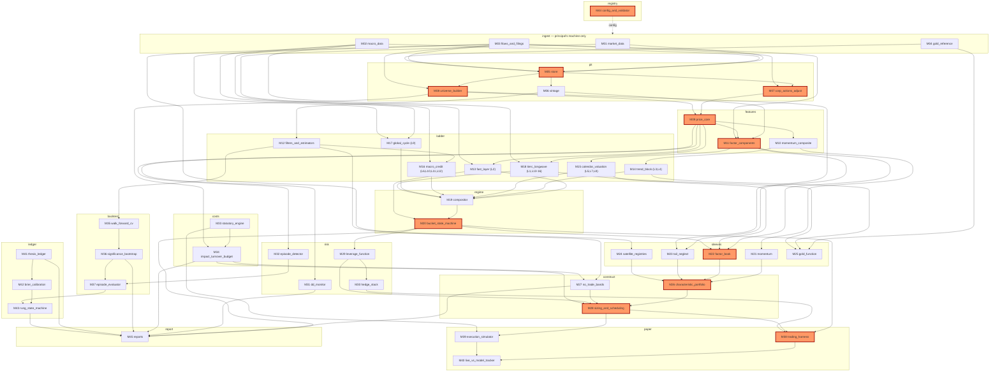

# Appendix B — Software Module & Test Specification

Version 0.1 · 2026-08-31 · Scope: build phases 0–6 (DESIGN §12). Binding inputs: `research/CONTRACT.md`,
`research/OPEN_QUESTIONS.md`, `docs/DESIGN.md` v0.9 (source of truth for every number cited here),
`config/*.yaml` (the parameter registry this code reads — never re-declares), and the corrections in
`research/register/consistency-audit.md` + `verification-log.md`. This appendix does not re-derive any
number; it specifies the code that computes with the numbers already frozen in `config/`.

**Hard constraints this spec is written to** (Contract §1/§10, prior #11): every module ships with
committed fixtures and runs green with **zero network access**; ingestion is the one exception and runs
only on the principal's machine, by hand, producing the fixtures everything else consumes; every
parameter a module needs is read from `config/*.yaml` via the registry loader, never hard-coded, never
re-declared locally; the price-only factor book (Phase 1) ships before any fundamentals-based signal
(Phase 6); no module anywhere imports an HP filter; `config/validator.py` (extended, not replaced) gates
every change to `config/*.yaml` in CI.

Corrections already applied and NOT to be reintroduced by this code: futures statutory round-trip is
**5.7bps**, not 7.7 (`costs.yaml:round_trip_all_in_bps.index_futures`); the SAST disclosure floor is
**₹11,000–30,000cr**, not ₹19,000–31,000cr (`costs.yaml:capacity_bounds.sast_disclosure_mcap_floor_cr`);
anchor lock-in selling is **gradual** (≈3.2% at 30d, ≈17.3% at 90d), not prompt
(`sleeves.yaml:special_situations.events.lockin_expiry_windows`); May-2026 was an **INR/FII-outflow
crisis**, not a qualifying equity drawdown episode (DESIGN §5.6) — the episode fixture and the episode
detector (M32) must classify it as non-qualifying and route it to the L9/gold test set instead.

---

## Contents
1. Repo layout
2. Module ID legend (M01–M45)
3. Module catalog (full spec per module)
4. Dependency DAG + critical path
5. Test strategy
6. Coding standards
7. Effort roll-up

---

## 1. Repo layout

```
quant/                        # all application code; one sub-package per layer below
  ingest/                     # per-source pullers + normalizers — RUNS ON PRINCIPAL'S MACHINE ONLY
  pit/                        # point-in-time store, vintage resolution, corp-action adj., universe
  features/                   # returns, vol, ranks, momentum/value/quality/low-vol/flag builders
  ladder/                     # L1-L16 state variables, Hamilton filter, tau_half estimator
  regime/                     # score compositor, bucket state machine
  sleeves/                    # momentum, factor book, tail, special-sits, gold, tactical shorts
  construct/                  # characteristic-portfolio optimizer, bands, sizing, staged entry
  risk/                       # leverage function, hedge stack, DD monitor, episode detector
  costs/                      # statutory engine, impact model, turnover budgeter
  backtest/                   # walk-forward/purged-CV, bootstrap, deflated Sharpe, episode eval
  paper/                      # paper-trading harness, execution simulator, live-vs-model tracker
  ledger/                     # Stage-2 thesis ledger, Brier/calibration, rung state machine
  registry/                   # typed config loader wrapping config/*.yaml + validator.py hook
  report/                     # daily/weekly/monthly report generation
config/                       # UNCHANGED by this appendix — the frozen parameter registry (existing)
research/                     # UNCHANGED — frozen research phase output (existing)
docs/                         # UNCHANGED except this appendix and its siblings
tests/
  fixtures/                   # committed, checksummed, hand-curated slices — see §5
    bhavcopy_eq/  bhavcopy_deriv/  india_vix/  rbi_dbie/  mospi/  nsdl_fpi/  amfi/
    wgc_lbma/  fred_imf_bis/  filings/  listings/  synthetic/
  golden/                     # committed expected-output snapshots, one per deterministic module
  unit/                       # mirrors quant/ package tree, one test module per source module
  property/                   # no-look-ahead sweep + determinism/seed checks (slower, path-filtered)
  MANIFEST.sha256             # checksum of every fixture file; CI fails on drift without a bump commit
scripts/
  run_ingestion.py            # principal's machine only; writes tests/fixtures/*, never runs in CI
  run_registry_check.py       # thin wrapper around config/validator.py for pre-commit + CI
  run_paper_cycle.py          # end-to-end paper-run driver (Phase 3+)
  regenerate_golden.py        # explicit, reviewed-in-diff golden-file regeneration
pyproject.toml
.ci/                          # lint / unit / registry / golden / no-look-ahead stage definitions
```

One-line purpose per top-level directory: `ingest/` gets data in, once, by hand, checksummed;
`pit/` makes every later query as-of-correct; `features/` turns adjusted prices (+ lagged fundamentals
from Phase 6) into per-name numbers; `ladder/` is the cycle stack (Contract's risk system); `regime/`
turns the ladder into one score and four buckets; `sleeves/` is the return system; `construct/` turns
sleeve signals into a portfolio; `risk/` and `costs/` are the two systems that can veto or price anything
construct produces; `backtest/`, `paper/`, `ledger/` are how every claim in this program gets validated,
rehearsed, and (for Stage 2) earns authority; `registry/` is the single gate; `report/` is the only
consumer nothing else depends on.

---

## 2. Module ID legend

| ID | Module | Layer | Effort |
|---|---|---|---|
| M01 | `ingest.market_data` | ingest | M |
| M02 | `ingest.macro_data` | ingest | M |
| M03 | `ingest.flows_and_filings` | ingest | M |
| M04 | `ingest.gold_reference` | ingest | S |
| M05 | `pit.store` | pit | M |
| M06 | `pit.vintage` | pit | L |
| M07 | `pit.corp_actions_adjust` | pit | M |
| M08 | `pit.universe_builder` | pit | L |
| M09 | `features.price_core` | features | S |
| M10 | `features.momentum_composite` | features | M |
| M11 | `features.factor_components` | features | L |
| M12 | `ladder.filters_and_estimators` | ladder | L |
| M13 | `ladder.fast_layer` | ladder | M |
| M14 | `ladder.trend_block` | ladder | M |
| M15 | `ladder.calendar_and_valuation_block` | ladder | M |
| M16 | `ladder.macro_credit_block` | ladder | L |
| M17 | `ladder.global_cycle_block` | ladder | M |
| M18 | `ladder.tierc_and_longwave_overlay` | ladder | M |
| M19 | `regime.compositor` | regime | L |
| M20 | `regime.bucket_state_machine` | regime | L |
| M21 | `sleeves.momentum` | sleeves | M |
| M22 | `sleeves.factor_book` | sleeves | L |
| M23 | `sleeves.tail_neglect` | sleeves | M |
| M24 | `sleeves.satellite_registries` | sleeves | L |
| M25 | `sleeves.gold_function` | sleeves | M |
| M26 | `construct.characteristic_portfolio` | construct | L |
| M27 | `construct.no_trade_bands` | construct | M |
| M28 | `construct.sizing_and_scheduling` | construct | L |
| M29 | `risk.leverage_function` | risk | M |
| M30 | `risk.hedge_stack` | risk | L |
| M31 | `risk.dd_monitor` | risk | M |
| M32 | `risk.episode_detector` | risk | M |
| M33 | `costs.statutory_engine` | costs | S |
| M34 | `costs.impact_and_turnover_budget` | costs | M |
| M35 | `backtest.walk_forward_cv` | backtest | L |
| M36 | `backtest.significance_and_bootstrap` | backtest | L |
| M37 | `backtest.episode_evaluator` | backtest | M |
| M38 | `paper.trading_harness` | paper | L |
| M39 | `paper.execution_simulator` | paper | M |
| M40 | `paper.live_vs_model_tracker` | paper | S |
| M41 | `ledger.thesis_ledger` | ledger | M |
| M42 | `ledger.brier_and_calibration` | ledger | M |
| M43 | `ledger.rung_state_machine` | ledger | L |
| M44 | `registry.config_and_validator` | registry | S |
| M45 | `report.reports` | report | M |

45 modules. Effort legend: **S** ≈ half a day · **M** ≈ 1–3 days · **L** ≈ 1–2 weeks (5–10 days).

---

## 3. Module catalog

Each entry: Purpose · Inputs (exact `config/*.yaml` ids where applicable) · Outputs · Key functions
(signatures in words) · Unit tests (named, fixture stated) · Acceptance criterion · Effort · Dependencies
(module IDs). DESIGN §-references are given for traceability back to the source of truth.

### Ingest layer — principal's machine only; never runs in CI; output is the fixture, checksummed once

#### M01 `ingest.market_data`
**Purpose.** Pulls and normalizes NSE/BSE cash-equity bhavcopy, F&O bhavcopy (OI + prices), and the
India-VIX daily archive into one canonical OHLCV+derivatives schema. This is the single source every
price-derived module downstream reads from.
**Inputs.** Raw exchange files (bhavcopy CSV/ZIP, F&O bhavcopy, VIX archive CSV) — no `config/` params;
schema/column-mapping constants live in code, not the registry (they are not research parameters).
**Outputs.** `RawMarketData(date, symbol, series_type) -> {open,high,low,close,volume,oi,delivery_pct}`
partitioned parquet, one file per pull date; a manifest row per file in `tests/fixtures/MANIFEST.sha256`.
**Key functions.** `pull_bhavcopy_eq(date) -> DataFrame`; `pull_bhavcopy_deriv(date) -> DataFrame`;
`pull_india_vix(date_range) -> DataFrame`; `normalize_symbols(df, isin_map) -> DataFrame` (handles
ticker renames/mergers so a symbol history doesn't silently fork).
**Unit tests.** `test_normalize_handles_symbol_rename` (fixture: `bhavcopy_eq/rename_case.csv`, a
synthetic two-symbol history spanning a documented rename); `test_schema_matches_canonical` (fixture:
one real bhavcopy day, hand-checked column-by-column); `test_missing_trading_day_is_explicit_not_ffilled`
(fixture: a holiday-adjacent window) — a gap must surface as `NaN`, never be silently forward-filled,
since downstream no-look-ahead tests depend on gaps being visible.
**Acceptance criterion.** Every committed fixture day round-trips through the normalizer byte-identical
on the fields that matter (price/volume/OI); symbol continuity across the fixture's one rename case is
correct; zero network calls in the test path (this module's own tests run against pre-pulled fixture
files, not live pulls — the puller functions themselves are exercised only by the principal, manually).
**Effort.** M. **Dependencies.** [M44].

#### M02 `ingest.macro_data`
**Purpose.** Pulls and normalizes the domestic macro block (RBI DBIE repo path/credit-GDP components/
CD ratio/HPI/FSR extracts, RBI OBICUS, MOSPI IIP+GFCF+PLFS) and the global macro block (FRED VIX/DXY/
DFII10, IMF WEO/FM/COFER, BIS credit series, cross-check only) into one monthly/quarterly panel with an
explicit publication-lag/knowledge-date column per series.
**Inputs.** Raw RBI/MOSPI/FRED/IMF/BIS extracts; no `config/` params of its own.
**Outputs.** `MacroSeries(series_id, period, value, knowledge_date)` — the `knowledge_date` column is
load-bearing: it is what makes `pit.vintage` (M06) possible and is what prior #7's restatement-bias fix
depends on.
**Key functions.** `pull_rbi_dbie(series_ids, date_range) -> DataFrame`; `pull_mospi(series_ids) ->
DataFrame`; `pull_fred_imf_bis(series_ids) -> DataFrame`; `attach_knowledge_date(df, publication_lag_map)
-> DataFrame`.
**Unit tests.** `test_knowledge_date_never_precedes_period_end` (fixture: `rbi_dbie/gdp_series.csv`);
`test_gfcf_restatement_produces_two_vintages_same_period` (fixture: `mospi/gfcf_restated.csv`, a
synthetic series where the same quarter appears twice with different values and knowledge dates —
proves the schema can even represent a restatement, which prior #7 says WILL happen); `test_repo_path_
matches_hand_transcribed_reference` (fixture: `rbi_dbie/repo_rate.csv` vs a manually verified table).
**Acceptance criterion.** Every series carries a `knowledge_date` strictly ≥ its period-end date; a
restated series is representable as two rows, never overwritten in place.
**Effort.** M. **Dependencies.** [M44].

#### M03 `ingest.flows_and_filings`
**Purpose.** Pulls and normalizes NSDL FPI flow/quarterly shareholding-pattern data, AMFI MF NAV/flow
data, SEBI/exchange SAST + promoter-pledge + RPT disclosure filings, and the corporate-action/IPO-
listing/index-reconstitution/anchor-lock-in calendars. The single most heterogeneous ingest module —
these are the sources with the least uniform machine-readable formats.
**Inputs.** Raw NSDL/AMFI/SEBI/exchange filings; no `config/` params of its own (event-type taxonomy is
code, not registry parameters).
**Outputs.** `FlowSeries(date, entity, flow_type, value)`; `FilingEvent(date, symbol, event_type,
payload)` where `event_type ∈ {sast_disclosure, pledge_change, rpt_flag, corp_action, index_recon,
anchor_unlock, demerger, buyback, delisting}`.
**Key functions.** `pull_nsdl_fpi(date_range) -> DataFrame`; `pull_amfi_flows(date_range) -> DataFrame`;
`pull_sast_pledge_rpt(symbols, date_range) -> list[FilingEvent]`; `pull_corp_action_calendar(date_range)
-> list[FilingEvent]`; `pull_listing_and_index_calendar(date_range) -> list[FilingEvent]`.
**Unit tests.** `test_pledge_change_event_captures_direction` (fixture: `filings/pledge_cascade_case.
json`, a synthetic reconstruction of a pledge-invocation-cascade pattern per D02/D12's ~10–15 India
episodes, used later by M11's quality-junk-term test); `test_anchor_unlock_event_carries_both_30d_and_
90d_tranche_dates` (fixture: `listings/anchor_unlock_sample.json`, matches the Aug-2026 SEBI study's
gradual-exit shape — 3.2%/17.3% — so downstream sizing never treats it as a cliff); `test_index_recon_
event_has_effective_and_announcement_dates_distinct` (fixture: `listings/index_recon_sample.json`).
**Acceptance criterion.** Every `FilingEvent` carries both an announcement date and (where applicable) an
effective date, distinct fields — no downstream module may conflate them (this is what makes the
special-sits sleeve's "announcement→effective window" rule computable at all).
**Effort.** M. **Dependencies.** [M44].

#### M04 `ingest.gold_reference`
**Purpose.** Pulls and normalizes WGC/LBMA gold price series and the WGC quarterly central-bank-buying
series, plus SGB/duty-change level-break dates as explicit annotated events (per `sleeves.yaml:
gold.series_hygiene`).
**Inputs.** Raw WGC/LBMA extracts; the duty-change dates (2013 hikes, Jul-2024 cut) are hard-coded
annotation constants, not registry parameters (they are historical facts, not swept/estimated numbers).
**Outputs.** `GoldSeries(date, usd_price, inr_price, cb_net_buying)`; `LevelBreakAnnotation(date, reason)`.
**Key functions.** `pull_wgc_lbma(date_range) -> DataFrame`; `decompose_inr_gold(usd_gold, usdinr) ->
DataFrame` (implements `sleeves.yaml`'s "INR gold = USD gold + USDINR, decomposed always" rule at the
data layer so no downstream module can skip the decomposition).
**Unit tests.** `test_inr_decomposition_reconstructs_inr_price` (fixture: `wgc_lbma/gold_2024.csv` +
synthetic USDINR — reconstructed INR price must match the raw INR quote to 3 decimal places);
`test_level_break_annotations_present_on_2013_and_2024_dates` (fixture: `wgc_lbma/gold_full_history.
csv`).
**Acceptance criterion.** Duty-change dates are never silently fit through by any downstream regression
that reads this series (enforced by M25 consuming the annotation, not by this module).
**Effort.** S. **Dependencies.** [M44].

### Point-in-time layer

#### M05 `pit.store`
**Purpose.** The append-only point-in-time storage engine (Parquet files + a DuckDB catalog) every
other module reads through. Nothing downstream ever opens a raw ingest file directly.
**Inputs.** M01–M04 outputs.
**Outputs.** A DuckDB view set (`market_data`, `macro_series`, `flow_series`, `filing_events`,
`gold_series`) over partitioned Parquet, queryable with an `as_of(t)` predicate baked into every view.
**Key functions.** `ingest_batch(source_module_output) -> None` (append-only; rejects any write that
would mutate a row already committed — corrections land as new rows with a later `knowledge_date`, never
as an update); `as_of_query(table, t, **filters) -> DataFrame`; `checksum_manifest() -> dict[path,sha256]`.
**Unit tests.** `test_append_only_rejects_mutation` (fixture: two conflicting rows for the same
`(symbol,date)` key, second write must raise, not overwrite); `test_as_of_query_excludes_future_
knowledge_dates` (fixture: `synthetic/two_vintage_series.parquet`, a series with a value known at t=100
and a restated value with `knowledge_date`=t=150 — an `as_of(120)` query must return only the first);
`test_checksum_manifest_matches_committed_MANIFEST_sha256`.
**Acceptance criterion.** No code path in the repo can construct a DataFrame that includes a row whose
`knowledge_date > as_of_t` — this is the single mechanical guarantee the no-look-ahead property test
(§5) ultimately rests on.
**Effort.** M. **Dependencies.** [M01, M02, M03, M04, M44].

#### M06 `pit.vintage`
**Purpose.** Resolves "what did we know as of date t" for every fundamentals/macro series with a
restatement history — the module that directly answers the prior-#7 question (free Indian fundamentals
restated with no knowledge date bias backtests upward 150–450bps/yr). Every fundamentals-based feature
in M11 must go through this module, never through `pit.store` directly.
**Inputs.** `pit.store` macro/filing views; no `config/` params (this is pure data-plumbing logic, not a
research parameter).
**Outputs.** `VintageResolved(entity, period, as_of_t) -> value` — a single deterministic function of
`(entity, period, t)`.
**Key functions.** `resolve_asof(entity, period, t) -> float | None`; `restatement_history(entity, period)
-> list[(knowledge_date, value)]` (exposed for the audit/report layer — every fundamental number this
system ever used must be re-derivable from this call); `price_only_shadow(feature_id) -> FeatureSpec`
(looks up and returns the mandatory price-only counterpart spec for any fundamentals-based feature —
this is the mechanical enforcement of prior #7's "no fundamental backtest without its price-only
counterpart" rule; M35's CI gate calls this and fails the build if a fundamentals feature has no
registered counterpart).
**Unit tests.** `test_resolve_asof_before_first_knowledge_date_returns_none` (fixture:
`synthetic/two_vintage_series.parquet`); `test_resolve_asof_returns_latest_known_not_latest_true`
(same fixture, at t between the two knowledge dates); `test_restatement_history_orders_by_knowledge_
date`; `test_price_only_shadow_raises_if_unregistered` (fixture: a deliberately unregistered
fundamentals feature id — must raise, not warn, per prior #7's "mandatory").
**Acceptance criterion.** For every synthetic two-vintage fixture, `resolve_asof` reproduces the manually
tabulated "what we knew when" table exactly; every fundamentals feature registered in M11 has a
non-`None` `price_only_shadow`.
**Effort.** L (the correctness bar here is unusually high — this is the module the entire "central
question" of the design, per prior #7, depends on getting right). **Dependencies.** [M05, M44].

#### M07 `pit.corp_actions_adjust`
**Purpose.** Applies split/bonus/dividend adjustments to price and shares-outstanding series so that
returns, net-share-issuance, and ADV are computed on a continuous, corporate-action-adjusted basis.
**Inputs.** `pit.store` market data + `ingest.flows_and_filings` corp-action events (M03).
**Outputs.** `AdjustedSeries(symbol, date) -> {adj_close, adj_shares_out, adj_factor}`.
**Key functions.** `build_adjustment_factors(corp_actions) -> Series` (cumulative backward-adjustment
factor); `apply_adjustment(raw_px, factors) -> AdjustedSeries`; `net_share_issuance(adj_shares_out) ->
Series` (feeds M11's Pontiff-Woodgate value component directly — this is the "price/shares only,
restatement-proof" construction DESIGN §6.2 requires).
**Unit tests.** `test_1_for_1_bonus_halves_adjusted_price_pre_event` (fixture:
`synthetic/bonus_event.csv`); `test_dividend_adjustment_does_not_alter_shares_out` (same fixture family,
a cash-dividend-only event); `test_net_share_issuance_flat_across_pure_price_split` (a split must not
register as issuance — this is the exact failure mode Pontiff-Woodgate's construction is chosen to
avoid); `test_no_lookahead_adjustment_factor` (generic harness).
**Acceptance criterion.** Adjusted-price continuity holds across every corp-action event in the fixture
set (no discontinuity > 0.1% on the ex-date after adjustment); net-share-issuance is invariant to splits/
bonuses and only moves on genuine primary issuance/buybacks.
**Effort.** M. **Dependencies.** [M05, M03, M44].

#### M08 `pit.universe_builder`
**Purpose.** Reconstructs, for every historical date, the survivorship-free NIFTY-750 constituent list
and each name's rank (by market cap), so that "ranks 1–500," "ranks 500–750," and the per-book
full-conviction/small-ticket universe splits (`books.yaml`) are all computable as-of any past date —
never off today's current index membership.
**Inputs.** `pit.store` market data (market cap history) + `ingest.flows_and_filings` index-
reconstitution events (M03); config: `books.yaml:books.<book>.universe_stated`,
`.universe_full_conviction`, `.universe_small_ticket`.
**Outputs.** `UniverseAsOf(date) -> DataFrame[symbol, rank, mcap, in_universe: bool]`.
**Key functions.** `reconstruct_membership(date) -> set[symbol]` (must include delisted/renamed/merged
names that were live at that date — the survivorship-free guarantee); `rank_by_mcap(date) -> Series`;
`book_universe(book, date) -> (full_conviction_set, small_ticket_set)` (reads `books.yaml`).
**Unit tests.** `test_delisted_name_appears_in_historical_universe_not_current` (fixture:
`synthetic/delisted_name_history.parquet`, a name live 2015–2019 then delisted — must appear in a
2017 `reconstruct_membership` call and be absent from today's); `test_rank_matches_hand_computed_
mcap_ordering` (fixture: `bhavcopy_eq/mcap_snapshot.csv`); `test_book_universe_split_matches_books_
yaml_thresholds` (fixture: same, cross-checked against `books.yaml:books.conservative.universe_full_
conviction` = "ranks 1-80"); `test_no_lookahead_membership` (a name added to the index in month M must
not appear as a member in month M−1).
**Acceptance criterion.** Zero survivorship leakage on the fixture's known delisted-name case;
`book_universe` outputs match `books.yaml`'s stated rank cutoffs exactly for all three books.
**Effort.** L (survivorship-free reconstruction from bhavcopy + index-recon events alone, with no paid
index-history feed, is the genuinely hard part of this module). **Dependencies.** [M05, M03, M44].

### Features layer

#### M09 `features.price_core`
**Purpose.** The shared price-derived toolkit — total-return series (with skip-month support),
trailing realized volatility, and the cross-sectional percentile-rank utility — used by every downstream
signal module. Kept as one module because these three primitives are used together everywhere and must
share one tested implementation (no signal module may hand-roll its own rank function).
**Inputs.** M07 adjusted series; no `config/` params of its own (lookback windows are passed in by
callers, e.g. `ladder.yaml`'s per-entry `tau_half_months`, not owned here).
**Outputs.** `total_return(symbol, date, horizon, skip_month=False) -> float`;
`realized_vol(symbol, date, window) -> float`; `xsec_rank(values) -> Series[0,1]`.
**Key functions.** `total_return(px, div_adj, horizon_months, skip_month) -> Series`;
`realized_vol(px, window, annualize=True) -> Series`; `xsec_rank(values_by_entity, method='average') ->
Series`.
**Unit tests.** `test_skip_month_excludes_most_recent_month_return` (fixture:
`synthetic/momentum_reference.csv`, hand-computed 12-1 return); `test_realized_vol_matches_reference_
numpy_std` (same fixture); `test_rank_ties_use_average_method` (fixture: synthetic tie-heavy cross-
section); `test_no_lookahead_returns` (generic harness, fixture: `bhavcopy_eq/five_year_sample.parquet`).
**Acceptance criterion.** Matches hand-computed reference values to 1e-9 on the fixture; no-look-ahead
property holds for 20 sampled dates.
**Effort.** S. **Dependencies.** [M07, M08, M44].

#### M10 `features.momentum_composite`
**Purpose.** Builds the L3 momentum composite (rank blend of 12-1 and 6-1 total return plus 52-week-high
proximity, skip-month retained) and applies the liquidity-discipline filters (DESIGN §6.1) that exclude
names where momentum is known to reverse rather than persist.
**Inputs.** M09 `total_return`/`xsec_rank`; config: `ladder.yaml:entries[L3_momentum_composite]`,
`sleeves.yaml:momentum.liquidity_rules`.
**Outputs.** `MomentumComposite(symbol, date) -> score ∈ [0,1]` plus a `filtered_out: bool` flag per name.
**Key functions.** `momentum_12_1(symbol, date) -> float`; `momentum_6_1(symbol, date) -> float`;
`week52_high_proximity(symbol, date) -> float`; `rank_blend(*components) -> Series`;
`apply_liquidity_filters(scores, circuit_flag, asm_gsm_stage, reconstitution_recent) -> Series`
(zeros out names per `sleeves.yaml:momentum.liquidity_rules` — circuit≥20% of recent days, ASM/GSM≥2, live
reconstitution pops, illiquid-tercile reversal per Chui et al.).
**Unit tests.** `test_rank_blend_matches_hand_computed_equal_weight` (fixture:
`synthetic/momentum_reference.csv`); `test_illiquid_tercile_names_excluded_not_zeroed` (proves the
filter removes the name from the ranking universe rather than just setting score=0, which would still
distort the cross-sectional rank of everyone else); `test_circuit_frequency_threshold_matches_config`
(reads `sleeves.yaml:momentum.liquidity_rules` directly, not a hard-coded 20%); `test_no_lookahead_
momentum_composite`.
**Acceptance criterion.** Matches a hand-built reference momentum ranking on the fixture; filter
thresholds are proven to be read from config, not hard-coded (a config-mutation test flips the threshold
and asserts the filtered set changes accordingly).
**Effort.** M. **Dependencies.** [M09, M03, M44].

#### M11 `features.factor_components`
**Purpose.** Builds the value, quality, low-vol, and size(quality-controlled) composites (DESIGN §6.2),
each in its Phase-1 price-only form first and its Phase-6 fundamentals-extended form second — every
fundamentals variant ships paired with its price-only counterpart, mechanically enforced via
`pit.vintage.price_only_shadow` (M06). Also builds the pledge/RPT junk-term flags and the microstructure
liquidity flags (band-lock frequency, GSM/T2T/circuit exclusions) that feed the quality composite and the
tail sleeve's hard filters respectively.
**Inputs.** M09 (returns/vol/rank), M07 (net-share-issuance), M06 (vintage-resolved fundamentals, Phase
6 only), M03 (pledge/RPT filing events, corp-action band-lock history); config:
`sleeves.yaml:factor_book.{value,quality,low_vol,size_quality_controlled}`.
**Outputs.** `ValueScore/QualityScore/LowVolScore/SizeScore(symbol, date) -> float`;
`PledgeRptFlag(symbol, date) -> {pledge_intensity, rpt_flag: bool}`;
`BandLockFrequency(symbol, date) -> percentile`; `LiquidityExclusion(symbol, date) -> bool`.
**Key functions.** `value_composite_price_only(div_yield, net_issuance, sales_px) -> Series` (Phase 1);
`value_composite_full(price_only, bp_lagged, ep_lagged, lag_months>=4) -> Series` (Phase 6, `>=50%
price-adjacent` weight enforced per `sleeves.yaml:factor_book.value.price_only_share_min`); `quality_
composite(profitability, stability, leverage, pledge_intensity, rpt_flag, junk_term_weight=0.5) ->
Series`; `low_vol_composite(realized_vol_rank) -> Series` (explicitly NOT the alpha-blended index
construct — the test below asserts this); `size_composite_satellite(junk_controlled_smb_proxy) ->
Series` (satellite-only, Tier C); `pledge_rpt_flags(filing_events) -> DataFrame`; `band_lock_frequency
(circuit_history, window) -> Series`.
**Unit tests.** `test_value_price_only_share_meets_50pct_floor` (fixture: `synthetic/value_inputs.csv` —
asserts the *weight*, not just presence, of price-adjacent terms ≥0.5 per config); `test_low_vol_is_
pure_vol_rank_not_index_replica` (fixture cross-checked against a synthetic "Nifty Alpha-Low-Vol-30-
style" alternative construct — must diverge, proving the two are not accidentally identical); `test_
pledge_intensity_flags_cascade_case` (fixture: `filings/pledge_cascade_case.json` from M03); `test_
quality_junk_term_weighted_at_50pct` (reads `sleeves.yaml:factor_book.quality.india_junk_terms_weight_
discount`, config-mutation test as in M10); `test_size_satellite_capped_at_config_ceiling` (reads
`sleeves.yaml:factor_book.size_quality_controlled.weight_range`); `test_band_lock_frequency_matches_
hand_count` (fixture: `bhavcopy_eq/circuit_history_sample.csv`); `test_price_only_counterpart_registered_
for_every_fundamentals_variant` (calls M06's `price_only_shadow` for each Phase-6 feature id — CI-fails
if any fundamentals feature lacks one, mechanically enforcing prior #7).
**Acceptance criterion.** Phase 1 delivers all four composites in price-only form with zero fundamentals
dependency (verified by a test that runs the Phase-1 build with `pit.vintage`'s fundamentals tables
empty and asserts no exception and non-null output); every Phase-6 fundamentals feature has a registered,
tested price-only counterpart.
**Effort.** L (four composites, two phases each, plus two India-specific flag builders, bundled in one
module because they share the PIT-fundamentals plumbing and the price-only-counterpart obligation).
**Dependencies.** [M09, M07, M06, M03, M44].

### Ladder layer (DESIGN §4 — the cycle stack; Contract's risk system)

#### M12 `ladder.filters_and_estimators`
**Purpose.** Two shared statistical engines used across the entire ladder: the Hamilton (2018)
regression filter (the ONLY filter this codebase may use for any gap/cycle construction — HP is banned
outright, enforced by lint, see §6) and the bias-corrected AR(1) `tau_half` estimator with the
Kendall/Marriott-Pope small-sample correction and HAC standard errors, used to both estimate each ladder
entry's `tau_half_months` and to order the ladder itself (Contract §4: "order the ladder by tau_half").
**Inputs.** Any macro/price series via `pit.store`/`pit.vintage`; config: `ladder.yaml:entries[*].
tau_half_months` (priors this module's estimates are checked against, never fit to).
**Outputs.** `hamilton_filter(series, h, p) -> (trend, gap)`; `tau_half(series) -> (estimate, ci_lo,
ci_hi)`.
**Key functions.** `hamilton_filter(y, h, p) -> DataFrame[trend, cycle]` (regression of y_t on y_{t-h},
...,y_{t-h-p+1}, per DESIGN §11.1's h=8q/p=4 and h=24m/p=12 conventions); `ar1_tau_half(series) -> float`
(τ½ = ln(0.5)/ln(ρ̂)); `kendall_bias_correction(rho_hat, T) -> rho_corrected` (E[ρ̂]−ρ ≈ −(1+3ρ)/T);
`hac_se(residuals, lags) -> se` (Newey-West, for overlapping-window inference); `rolling_stability_
check(series, break_dates=[1991,2003,2008,2016,2020]) -> DataFrame` (per DESIGN §11.2's mandatory
stability check before trusting a full-sample estimate).
**Unit tests.** `test_hamilton_filter_reproduces_textbook_worked_example` (fixture:
`synthetic/hamilton_reference_series.csv`, a series with a known closed-form trend/cycle decomposition);
`test_hp_filter_is_not_importable` (a static-analysis test asserting no module in `quant/` imports
`statsmodels.tsa.filters.hp_filter` or equivalent — this is the mechanical enforcement of the HP-filter
ban); `test_kendall_correction_matches_known_small_sample_bias` (fixture: `synthetic/ar1_known_rho_0.85_
T60.csv`, simulated with a known true ρ, asserts the corrected estimate is closer to truth than the raw
one); `test_tau_half_confidence_interval_widens_as_rho_approaches_1` (Andrews/Hansen regime, per DESIGN
§11.2); `test_rolling_stability_flags_break_at_2020`.
**Acceptance criterion.** Hamilton filter matches the closed-form reference to 1e-6; the HP-filter
import-ban test passes on every commit (a CI stage, not just a unit test — see §5); Kendall correction
reduces bias vs the naive AR(1) estimator on the known-ρ synthetic fixture.
**Effort.** L. **Dependencies.** [M06, M44].

#### M13 `ladder.fast_layer`
**Purpose.** L2: the reactive risk-off switch — realized-vol top-decile rank, India-VIX backwardation,
and CCIL/NSDL funding-flow-stress rank. Any single trigger arms R4 risk-cuts; two independent channels
confirm full R4. The only ladder entry with same-day-to-2-day authority; explicitly never framed as
predictive.
**Inputs.** M09 (realized vol), M01 (India-VIX term structure), M03 (NSDL FPI outflow run, CCIL repo/CP
spread proxy if available else flagged unavailable); config: `ladder.yaml:entries[L2_fast_stress]`.
**Outputs.** `FastTriggerState(date) -> {vol_decile: bool, vix_backwardation: bool, funding_stress: bool,
n_triggers: int}`.
**Key functions.** `realized_vol_decile_rank(vol_series, window) -> bool`; `vix_term_structure_state
(vix_series) -> {contango, backwardation}`; `funding_flow_stress_rank(ccil_spread, fii_outflow_run) ->
bool`; `combine_triggers(*flags) -> FastTriggerState`.
**Unit tests.** `test_backwardation_detected_on_mar_2020_fixture` (fixture: `india_vix/mar_2020.csv`,
the documented 25→64→~80s episode — must fire); `test_single_trigger_arms_not_confirms` (asserts
`n_triggers==1` maps to "arm," not "confirm," per `ladder.yaml`'s role text); `test_no_trigger_on_
benign_fixture` (fixture: a calm 2017 window — must not false-positive); `test_no_lookahead_fast_
trigger` (the trigger at date t must use only data through t — this is the module where a look-ahead
bug would be most dangerous, since it directly gates leverage).
**Acceptance criterion.** Fires on the Mar-2020 fixture, does not fire on the calm fixture; the arm/
confirm distinction is testable and correct.
**Effort.** M. **Dependencies.** [M09, M01, M03, M44].

#### M14 `ladder.trend_block`
**Purpose.** L3 (momentum composite as regime confirmation, not just a return sleeve) + L4 (time-series
momentum on Nifty and gold, 1–12m sign/rank).
**Inputs.** M10 (momentum composite), M01 (index futures, gold price series); config:
`ladder.yaml:entries[L3_momentum_composite, L4_tsmom_index_gold]`.
**Outputs.** `TrendBlockScore(date) -> float ∈ [-1,1]` (feeds `regime.compositor`'s `trend_tsmom` block);
`GoldMomentumTilt(date) -> float` (feeds `sleeves.gold_function`'s momentum input separately).
**Key functions.** `tsmom_signal(price_series, lookback_months) -> sign_or_rank`; `combine_trend_
inputs(momentum_composite_agg, tsmom_equity, tsmom_gold) -> float`.
**Unit tests.** `test_tsmom_sign_matches_hand_computed_on_known_uptrend` (fixture:
`synthetic/known_trend_series.csv`); `test_trend_block_score_bounded_in_range`; `test_gold_momentum_
tilt_isolated_from_equity_trend` (asserts the two outputs are independently computable — sleeves.gold_
function must not accidentally inherit equity trend state).
**Acceptance criterion.** Matches hand-computed sign/rank on the known-trend fixture; block score stays
within [-1,1] across the full fixture history.
**Effort.** M. **Dependencies.** [M10, M01, M44].

#### M15 `ladder.calendar_and_valuation_block`
**Purpose.** L5 (election/budget/fiscal-year/expiry calendar — timing/vol-scheduling only, direction
is never a bet), L7 (issuance/sentiment cycle: IPO share, first-day pops, SME froth), L8 (value spread
conditioner). Grouped in one module because all three are lower-budget (`calendar`≤5%,
`valuation_sentiment`≤10%) conditioning/scheduling inputs rather than primary risk-cut triggers.
**Inputs.** M03 (ECI/budget calendar, SEBI bulletins, first-day-pop data), M11 (value composite for the
spread conditioner), M01 (India-VIX for calendar-window vol scheduling); config:
`ladder.yaml:entries[L5_calendar_windows, L7_issuance_sentiment, L8_value_spread]`.
**Outputs.** `CalendarWindowState(date) -> {in_window: bool, window_type}` (never a direction);
`IssuanceSentimentScore(date) -> float`; `ValueSpreadPercentile(date) -> float ∈ [0,1]`.
**Key functions.** `election_budget_window(date, calendar) -> CalendarWindowState`; `issuance_sentiment
(ipo_share, first_day_pops, sme_froth) -> float`; `value_spread_percentile(value_composite_dispersion,
window='expanding') -> float`.
**Unit tests.** `test_calendar_window_never_exposes_a_direction_field` (a schema test — the output type
literally has no directional field, making a directional bet a type error, not just a discipline
violation); `test_2024_election_window_detected` (fixture: `filings/election_calendar_2024.csv`);
`test_value_spread_percentile_matches_hand_computed_decile` (fixture: `synthetic/value_dispersion_
history.csv`); `test_no_lookahead_value_spread`.
**Acceptance criterion.** Calendar module structurally cannot emit direction; value-spread percentile
reproduces the hand-computed reference on the fixture.
**Effort.** M. **Dependencies.** [M03, M11, M01, M44].

#### M16 `ladder.macro_credit_block`
**Purpose.** The single most complex ladder module: L6 (monetary stance, lagged ~1y), L10 (Hamilton-
filtered credit/GDP gap — own construction, never BIS's HP version — plus CD-ratio percentile,
bank+NBFC aggregate, issuance quality, GNPA as lagging confirm only), L11 (capex cycle, Tier C,
**clamped to min(0, reading) before aggregation** per the consistency-audit's critical finding C2 — a
hot capex print may confirm a deterioration but must never itself add regime-score budget through the
shared block average), L12 (real-estate/medium financial cycle, phase-uncertainty prior only, 10–20y
range never an 18y point estimate). Implements the DESIGN §4.2 de-duplication rule as executable code,
not prose.
**Inputs.** M12 (Hamilton filter), M02 (RBI credit/GDP/CD-ratio/HPI/OBICUS/IIP/GFCF series via M06
vintage resolution); config: `ladder.yaml:entries[L6_monetary_stance, L10_credit_block, L11_capex_cycle,
L12_realestate_medium_cycle]`, `ladder.yaml:budgets.regime_score_blocks.macro_credit_block` (= 0.20 —
**the registry's committed number; DESIGN.md's own prose said 25% in two places, an internal
inconsistency the consistency audit (C1) flagged and this code must follow the config, not the prose**).
**Outputs.** `MacroCreditBlockScore(date) -> float` — the single composite the regime compositor
consumes for this block.
**Key functions.** `credit_gdp_gap(credit_series, gdp_series, h, p) -> Series` (calls M12's
`hamilton_filter`, never BIS's HP series, per Contract §8); `cd_ratio_percentile(cd_series) -> Series`;
`bank_nbfc_aggregate(bank_credit, nbfc_credit) -> Series` (the NBFC-2018 lesson, per DESIGN §14, requires
NBFC credit be included, not just bank credit); `capex_cycle_clamped(obicus, iip_capgoods, gfcf) ->
Series` **must internally apply `min(0, reading)` before returning** — this is the exact function the
consistency-audit's C2 finding says nothing currently enforces at the aggregation-formula level (the
existing `validator.py` only checks the entry's `reduce_only` *flag*, never the composite math); `compose
_macro_credit_block(l6, l10, l11_clamped, l12, method='first_pc_or_mean') -> Series`.
**Unit tests.** `test_credit_gap_uses_hamilton_never_hp` (asserts the function signature/call path
never touches an HP-filter routine — cross-checked with M12's import-ban test); `test_capex_positive_
reading_does_not_raise_composite_score` (fixture: `synthetic/capex_hot_credit_cooling.csv` — engineered
so L11 alone reads strongly positive while L6/L10/L12 read negative; asserts the composite score is
**no higher** than it would be with L11 excluded entirely — this is the direct regression test for
consistency-audit finding C2, the single most important test in this module); `test_capex_negative_
reading_does_lower_composite` (the reduce-only direction must still work); `test_bank_nbfc_aggregate_
includes_nbfc_component` (fixture engineered so bank-only credit is flat but NBFC credit is expanding —
composite must move); `test_block_budget_matches_config_not_design_prose` (reads `ladder.yaml:budgets.
regime_score_blocks.macro_credit_block == 0.20`, and separately documents in the test docstring that
DESIGN.md §4.1/§4.2 prose currently says 25% — a reader who "fixes" this test to match the prose without
first correcting DESIGN.md and re-running `config/validator.py`'s sum-to-1.0 check will break CI, which
is the intended trip-wire).
**Acceptance criterion.** `test_capex_positive_reading_does_not_raise_composite_score` passes (this is
the module's real acceptance bar — everything else is necessary but this is sufficient to catch a
recurrence of C2); Hamilton-not-HP import assertion passes; block score matches `ladder.yaml`'s 0.20
budget in the compositor's normalization.
**Effort.** L. **Dependencies.** [M12, M02, M06, M44].

#### M17 `ladder.global_cycle_block`
**Purpose.** L9: the global financial cycle (dollar/VIX/US-rate state → EM flows), the one Tier-A-
pooled-methodology ladder entry — India cannot hedge this away (Rey's "dilemma not trilemma"). Includes
the Kilian-decomposed oil input (never raw price level, per `ladder.yaml`).
**Inputs.** M02 (FRED VIX/DXY/DFII10), M03 (NSDL FPI, INR); config:
`ladder.yaml:entries[L9_global_financial_cycle]`.
**Outputs.** `GlobalCycleScore(date) -> float`.
**Key functions.** `global_risk_state(vix, dxy, dfii10) -> float`; `kilian_oil_decomposition(oil_price,
supply_proxy, demand_proxy) -> Series` (never raw WTI/Brent level — a raw-level-only fixture must fail
a dedicated test); `fii_flow_response(global_risk_state, nsdl_flows) -> float`.
**Unit tests.** `test_kilian_decomposition_rejects_raw_price_only_input` (a raw oil-price-only call
without supply/demand decomposition components must raise `TypeError`, not silently degrade); `test_
global_risk_state_spikes_on_2026_inr_crisis_fixture` (fixture: `fred_imf_bis/may_2026_window.csv` +
`nsdl_fpi/may_2026_outflow.csv` — per the verification log, this is the correctly-characterized test
case for L9, NOT for the DD-violation episode set); `test_no_lookahead_global_cycle`.
**Acceptance criterion.** Fires strongly on the May-2026 INR-crisis fixture (the module's designed live
test case per the citation audit's correction); raw-oil-level misuse is structurally blocked.
**Effort.** M. **Dependencies.** [M02, M03, M44].

#### M18 `ladder.tierc_and_longwave_overlay`
**Purpose.** The reduce-only/no-seat entries bundled together because they share one structural
property — none may ever add regime-score budget: L1 (1-month reversal, contrarian sanity flag, zero
return budget), L13 (household-debt 3y change, zero completed India down-legs), L14 (float-scaled FII
positioning extremes, capacity argument — explicitly NOT the excluded flow-momentum variant), L15
(long-wave fiscal/monetary state — debt trajectory, negative-real-rate persistence, reserve
diversification — expressed ONLY via the gold-floor attribution and slow-debasement tail budget, never a
regime-score seat), L16 (demographic arc — context only, zero allocation authority).
**Inputs.** M09 (L1's price data), M03 (household debt via M02 really — household debt/FII positioning
via NSDL/RBI FSR), M02 (IMF WEO/COFER for L15), M04 (RBI gold buying via WGC series for L15's reserve-
diversification leg); config: `ladder.yaml:entries[L1_reversal_1m, L13_household_debt, L14_fii_
positioning, L15_long_wave_fiscal, L16_demographics]`, `ladder.yaml:budgets.tierC_overlay_cap` (0.10),
`ladder.yaml:budgets.long_wave_expression`.
**Outputs.** `TierCOverlayShift(date) -> float ≤ 0` (feeds `regime.compositor`, capped at −0.10, never
positive — enforced by return type, not just convention); `LongWaveExpression(date) -> {gold_floor_
attribution_pct, tail_budget_nav_yr, conditional_lift_pp}` (feeds `sleeves.gold_function` directly,
bypassing the regime score entirely, per DESIGN §4.3).
**Key functions.** `tierc_overlay(l1, l13, l14) -> float` (internally `min(0, sum(...))`, clipped at
−0.10); `reversal_flag(price_series) -> float` (sanity-flag only — a unit test asserts its output is
never wired to a return-sleeve weight anywhere in the sleeves layer, i.e. a static dependency-graph
check that no `sleeves.*` module imports this function's output as a signal); `long_wave_expression(debt_
trajectory, real_rate_persistence, reserve_diversification) -> LongWaveExpression` (the co-occurrence
rule: the conditional +1–2pp gold-floor lift fires only when all three legs are simultaneously active,
reverting when any one lapses).
**Unit tests.** `test_tierc_overlay_output_type_cannot_be_positive` (return-type-level guarantee, not
just a value check); `test_overlay_capped_at_negative_0.10_even_if_raw_sum_exceeds_it`; `test_l1_
reversal_never_imported_by_any_sleeve_module` (a static-analysis test over `quant/sleeves/`); `test_
longwave_conditional_lift_reverts_when_one_leg_lapses` (fixture: `synthetic/longwave_three_leg_
history.csv`, engineered so one leg flips mid-series — lift must drop even though the other two legs
are unchanged).
**Acceptance criterion.** Both structural guarantees (overlay never positive; L1 never reaches a
sleeve) hold as executable tests, not just documentation; the three-leg conditional lift reverts
correctly on the engineered fixture.
**Effort.** M. **Dependencies.** [M09, M02, M03, M04, M44].

### Regime layer (DESIGN §5.1–5.3)

#### M19 `regime.compositor`
**Purpose.** Combines the ladder's Tier-A/B block outputs (M13–M17) into the single regime score
R ∈ [−1,+1] via the equal-weight-anchored combination (Rapach-Strauss-Zhou), applies the per-block
budget caps, and applies the Tier-C overlay (M18) as a final negative-only shift.
**Inputs.** M13, M14, M15, M17 block scores; M16's macro-credit composite; M18's overlay shift; config:
`ladder.yaml:budgets.regime_score_blocks` (fast_stress 0.25, trend_tsmom 0.20, macro_credit_block 0.20,
global_cycle 0.20, valuation_sentiment 0.10, calendar 0.05 — **must sum to ≤1.0, enforced already by
`config/validator.py`; this module must read the sum from config and fail loudly, not silently
renormalize, if a future edit breaks the invariant before the validator even runs**), `ladder.yaml:
budgets.tierC_overlay_cap` (0.10).
**Outputs.** `RegimeScore(date) -> float ∈ [-1,1]`.
**Key functions.** `combine_blocks(block_scores, budgets) -> float` (equal-weight-anchored combination
within each block's budget share); `apply_tierc_overlay(r, overlay_shift, cap=0.10) -> float` (final
shift, clipped, never positive per M18's guarantee); `assert_budgets_sum_le_one(budgets) -> None`
(defense-in-depth — the registry validator already checks this at load time, but this module re-checks
at every compute call since a hand-edited config could theoretically bypass CI in a hotfix).
**Unit tests.** `test_combine_blocks_matches_hand_computed_weighted_average` (fixture:
`synthetic/six_block_score_history.csv`); `test_overlay_shift_only_ever_reduces_R` (property test:
for every sampled date, `R_with_overlay <= R_without_overlay`); `test_budget_sum_violation_raises_not_
renormalizes` (a deliberately mutated budget dict summing to 1.05 must raise, matching `validator.py`'s
own refusal semantics — never a silent renormalization that would mask a real config bug); `test_no_
lookahead_regime_score`.
**Acceptance criterion.** R is bounded in [−1,1] on the full fixture history; overlay is proven
strictly non-positive in its effect on every sampled date; a broken budget sum raises rather than
degrading silently.
**Effort.** L (the aggregation-semantics correctness here is exactly what the consistency audit's C1/C2
findings show is easy to get wrong even with a clean-loading registry). **Dependencies.** [M13, M14, M15,
M16, M17, M18, M44].

#### M20 `regime.bucket_state_machine`
**Purpose.** Maps R's own quantile/sign history to the four regime buckets (R1 Benign … R4 Crisis),
implements the fast-trigger override (M13's `n_triggers` can jump straight to full R4 regardless of R),
and implements the per-sleeve re-entry rules (DESIGN §5.7) as the bucket's hysteresis/state logic. A
rule-based state machine only — explicitly never a fitted Markov switch (Contract §8: <10 observed
transitions).
**Inputs.** M19 (regime score R), M13 (fast-trigger state); config: `risk.yaml:regime_buckets` (R1–R4
leverage/hedge ranges), `risk.yaml:cash_call_reentry` (per-sleeve re-entry family assignment + tranche
count).
**Outputs.** `BucketState(date) -> {bucket: R1|R2|R3|R4, entered_at, days_in_bucket}`;
`ReentryState(sleeve, date) -> {eligible: bool, tranche_progress}`.
**Key functions.** `bucket_from_quantile(r_history, r_t) -> Bucket` (quantile/sign rule on R's own
expanding history — never a fixed numeric threshold, per Contract §6); `apply_fast_trigger_override
(bucket, fast_trigger_state) -> Bucket` (single trigger → begin R4 cuts; two independent channels → full
R4, per DESIGN §5.3); `reentry_hysteresis(sleeve, exit_indicator, band_width) -> bool` (factor book);
`reentry_vol_target(sleeve, trailing_vol_quantile) -> float` (momentum/fast sleeves, Barroso-Santa-Clara
form); `reentry_calendar_tranche(days_since_r4_exit, n_tranches, fast_trigger_quiet) -> float` (post-R4
book-level, 2–3 tranches per `risk.yaml:cash_call_reentry.tranches`).
**Unit tests.** `test_single_fast_trigger_begins_r4_cuts_not_full_r4` (fixture: engineered `n_triggers=
1` history); `test_dual_fast_trigger_forces_full_r4` (`n_triggers=2`); `test_no_fitted_markov_switch_
anywhere` (static-analysis test: no `hmmlearn`/`statsmodels.tsa.regime_switching` import anywhere in
`quant/regime/`); `test_reentry_calendar_tranche_pauses_if_fast_trigger_refires` (fixture: a synthetic
R4-exit-then-re-entry-then-refire sequence — tranche progress must reset, matching the "single-print
re-entry into a renewed leg is the failure mode" rationale); `test_bucket_boundaries_are_quantile_not_
fixed_threshold` (a config-mutation test: shifting R's historical distribution must shift the bucket
boundary, proving it is not a hard-coded number).
**Acceptance criterion.** Fast-trigger override logic matches DESIGN §5.3 exactly on both engineered
fixtures; no fitted regime-switching import exists anywhere; re-entry tranche logic correctly resets on
a refire.
**Effort.** L. **Dependencies.** [M19, M13, M44].

### Sleeves layer (DESIGN §6 — the return system)

#### M21 `sleeves.momentum`
**Purpose.** The aggressive book's fast momentum sleeve: applies the decay haircut, the Barroso-Santa-
Clara inverse-vol crash guard plus Daniel-Moskowitz bear-state cut, and enforces the sleeve's own
≤200%/yr turnover budget (moderate book uses this only as a ≤1/5-budget rank tiebreaker).
**Inputs.** M10 (momentum composite), M13 (realized vol for the crash guard); config:
`sleeves.yaml:momentum` (haircut, crash_guard, crowding_monitor, book_roles).
**Outputs.** `MomentumSleeveWeight(symbol, date, book) -> float` (pre-construction signal, not yet a
portfolio weight).
**Key functions.** `apply_decay_haircut(raw_score, haircut_range) -> float`; `crash_guard_scale(sleeve_
gross, trailing_momentum_spread_vol) -> float` (Barroso-Santa-Clara inverse-vol scaling);
`bear_state_cut(market_return_quantile) -> float` (Daniel-Moskowitz); `crowding_monitor(smart_beta_aum_
growth) -> haircut_escalation` (mirrors low-vol's AUM trigger, per the mid-2025 quant-unwind red-team
finding — escalates the haircut toward 58% on a second crowding-unwind episode).
**Unit tests.** `test_crash_guard_reduces_gross_in_high_vol_fixture` (fixture:
`synthetic/momentum_spread_vol_spike.csv`); `test_bear_state_cut_fires_in_worst_historical_quantile`
(fixture: 2008/2020 windows from `bhavcopy_eq`); `test_moderate_book_role_capped_at_one_fifth_
turnover_budget` (reads `sleeves.yaml:momentum.book_roles.moderate`); `test_crowding_monitor_escalates_
haircut_on_second_episode` (fixture: two synthetic AUM-growth spikes in sequence).
**Acceptance criterion.** Crash guard and bear-state cut both fire correctly on their designed fixtures;
moderate-book turnover role is mechanically capped, not just documented.
**Effort.** M. **Dependencies.** [M10, M13, M44].

#### M22 `sleeves.factor_book`
**Purpose.** The moderate book's engine (Decision Q6): combines value/quality/low-vol/size composites
(M11) into the weighted factor book, applies the three conditioners (value-spread tilt, quality
valuation-kill-switch, value-spread-bottom-tercile momentum tilt).
**Inputs.** M11 (four composites), M15 (value-spread percentile), M20 (bucket state, for the quality
floor's "binds in late-cycle states" rule); config: `sleeves.yaml:factor_book` (weight ranges, haircuts,
conditioners).
**Outputs.** `FactorBookWeight(symbol, date, book) -> float`.
**Key functions.** `weight_composites(value, quality, low_vol, size, weight_ranges) -> float`; `value_
spread_conditioner(value_weight, spread_percentile) -> float` (up when top tercile); `quality_kill_
switch(quality_weight, quality_relvaluation_percentile, bucket) -> float` (cut toward floor when own
rel-valuation top decile OR floor binds late-cycle per bucket state); `momentum_tilt_on_bottom_tercile
(spread_percentile, momentum_score) -> float`.
**Unit tests.** `test_value_weight_rises_in_top_tercile_spread_fixture` (fixture:
`synthetic/value_spread_history.csv`); `test_quality_cuts_to_floor_on_2024_25_rerating_fixture` (fixture:
engineered to replicate the "live Arnott warning" quality re-rating/unwind episode DESIGN §6.2 cites);
`test_weight_ranges_never_breach_config_bounds` (property test over the full fixture history, reads
`sleeves.yaml:factor_book.<sleeve>.weight_range`); `test_no_lookahead_factor_book_weight`.
**Acceptance criterion.** All three conditioners fire correctly on their designed fixtures; weights never
breach `sleeves.yaml`'s configured ranges at any sampled date.
**Effort.** L (this is the moderate book's central engine — DESIGN explicitly calls it the anchor).
**Dependencies.** [M11, M15, M20, M44].

#### M23 `sleeves.tail_neglect`
**Purpose.** The aggressive book's capacity-protected tail sleeve (ranks 300–750 small-ticket universe):
value/quality/neglect selection, momentum explicitly forbidden (illiquid-tercile reversal), band-lock and
GSM/T2T/SME hard filters, absolute-₹ (not %NAV) sizing.
**Inputs.** M11 (value/quality composites, band-lock frequency, liquidity exclusion flags), M08
(small-ticket universe); config: `sleeves.yaml:tail_neglect_sleeve`, `books.yaml:books.aggressive.
universe_small_ticket`.
**Outputs.** `TailSleeveWeight(symbol, date) -> absolute_rs_amount` (never a %NAV figure — the type
itself enforces the "absolute-₹ sleeve, not %NAV" rule).
**Key functions.** `select_tail_candidates(value, quality, band_lock_pctile, gsm_stage, sme_flag) ->
list[symbol]` (momentum score is never an input — a unit test asserts this by signature inspection);
`size_absolute_rs(candidates, book_capital) -> Series` (shrinks as %NAV as capital grows ₹100→250cr,
verified by a property test across a swept capital parameter).
**Unit tests.** `test_momentum_never_a_selection_input` (signature/static-analysis check); `test_sme_
platform_names_always_excluded` (fixture: a synthetic SME-flagged name — must never appear in output at
any date); `test_absolute_rs_sizing_shrinks_as_pct_nav_when_capital_grows` (property test: same absolute-
₹ position size, swept book_capital from ₹100cr→₹250cr, %NAV must monotonically fall); `test_band_lock_
frequency_filter_excludes_high_lock_names` (fixture: `bhavcopy_eq/circuit_history_sample.csv`).
**Acceptance criterion.** Momentum structurally absent from selection; SME/GSM≥2/T2T names never
selected; absolute-₹ sizing verified to shrink as %NAV under the capital-growth property test.
**Effort.** M. **Dependencies.** [M11, M08, M44].

#### M24 `sleeves.satellite_registries`
**Purpose.** The special-situations event registries (index inclusion/exclusion, demergers/spin-offs,
buyback/tender/delisting arb, anchor/promoter lock-in expiries, bulk/block-following) plus the tactical
single-name short sleeve (Nifty-100 only, capped ≤25% of total short-side exposure) — both Tier-C-
capped-or-starting-at-zero satellite mechanisms confined to the aggressive book.
**Inputs.** M03 (all filing/listing/index-recon/anchor-unlock events), M15 (L7 issuance-cycle state for
froth-sizing); config: `sleeves.yaml:special_situations`, `risk.yaml:tactical_short_sleeve`.
**Outputs.** `SpecialSitPosition(symbol, event_type, date) -> weight`; `TacticalShortPosition(symbol,
date) -> weight` (starts at zero; only usable to reduce net exposure in R3/R4 until a signal passes the
§11 gates — a type/state flag on the output, not just documentation).
**Key functions.** `index_recon_flow_sizing(announcement_date, effective_date, passive_aum_estimate) ->
float` (rising haircut, re-estimated annually — the haircut parameter is read from config, never
hard-coded to a decade-old number); `demerger_hold_window(parent, spinco, event_date) -> (entry, exit)`
(3–12m through forced index selling); `buyback_tender_arb(deal_terms, proration_estimate) -> float`;
`lockin_no_adds_window(unlock_date, gradual_exit_shape) -> DateRange` (**must reflect the Aug-2026 SEBI
study's gradual-exit shape — a test asserts the module does NOT implement a cliff-sell assumption**);
`bulk_block_following(rank, sign_quantile) -> float` (ranks 500–750 only); `tactical_short_signal(pledge_
cascade, index_deletion_window, l7_froth_flag) -> float` (capped output, `reduce_only_until_validated:
bool` flag always `True` at inception).
**Unit tests.** `test_sleeve_cap_read_from_config_not_hardcoded` (reads `sleeves.yaml:special_situations.
sleeve_cap_nav` = 0.10, config-mutation test); `test_lockin_window_uses_gradual_not_cliff_exit_shape`
(fixture: `listings/anchor_unlock_sample.json` — position sizing around the unlock date must NOT assume
a cliff, matching the corrected verification-log finding); `test_tactical_short_starts_at_zero_and_
flagged_reduce_only` (asserts the state flag on day 1 of any fixture); `test_tactical_short_capped_at_
25pct_of_short_side` (reads `risk.yaml:tactical_short_sleeve.cap_share_of_short_side`); `test_ipo_
allotment_excluded_as_a_sleeve` (a structural test: no function in this module accepts "IPO allotment"
as an entry type — per DESIGN §6.4's explicit exclusion).
**Acceptance criterion.** Lock-in window sizing matches the corrected gradual-exit evidence, not the
originally-assumed prompt-sell mechanism; tactical shorts provably start at zero and stay reduce-only
until the module records a passed §11 gate; sleeve caps trace to config.
**Effort.** L (six distinct event-rule families plus the tactical-short sleeve, each with its own small
but real state machine). **Dependencies.** [M03, M15, M44].

#### M25 `sleeves.gold_function`
**Purpose.** The gold weight function: floor + tactical band × composite score (real-rate, CB-buying
regime, INR/REER tilt, gold momentum, crisis kicker), plus the long-wave gold-floor attribution and
conditional lift (from M18), plus the mandatory INR=USD+FX decomposition and level-break hygiene (from
M04).
**Inputs.** M04 (gold series, level-break annotations), M14 (gold momentum tilt), M18 (long-wave
expression), M02 (real-rate proxy, IMF COFER); config: `sleeves.yaml:gold`.
**Outputs.** `GoldWeight(book, date) -> float` (bounded by `floors`/`ceilings_total` per book).
**Key functions.** `gold_score(real_rate_input, cb_buying_regime, inr_reer_tilt, gold_momentum,
crisis_kicker, weights) -> float ∈ [0,1]`; `gold_weight(book, floor, band, score) -> float`; `apply_
level_break_guard(regression_inputs, level_break_dates) -> None` (raises if any fitting routine's date
range spans a level break without an explicit dummy/segment split — mechanically enforces "never fit
through" per `sleeves.yaml:gold.series_hygiene`).
**Unit tests.** `test_gold_weight_never_exceeds_config_ceiling` (property test across full fixture
history, per book); `test_level_break_guard_raises_on_naive_regression_across_2024_duty_cut` (a
deliberately naive fit spanning the Jul-2024 cut must raise); `test_real_rate_weight_halved_post_2022`
(reads `sleeves.yaml:gold.score_inputs.real_rate` weight and the post-2022 half-weighting note);
`test_crisis_kicker_does_not_fire_falsely_on_2013_inr_depreciation_fixture` (the 2013 counterexample
DESIGN §6.5 explicitly flags — gold's INR return did not get rescued that time, and the kicker must not
overstate it).
**Acceptance criterion.** Weight never breaches configured ceilings; level-break guard is a real,
tested exception path, not a comment; the 2013 counterexample fixture behaves as DESIGN documents.
**Effort.** M. **Dependencies.** [M04, M14, M18, M02, M44].

### Construct layer (DESIGN §7 — Stage 3, equity cross-section only)

#### M26 `construct.characteristic_portfolio`
**Purpose.** The Brandt-Santa-Clara-Valkanov characteristic-portfolio policy (active weight = smooth
monotone saturating function of blended signal-percentile rank; no expected-return vector anywhere),
Ledoit-Wolf-shrunk covariance used only for risk-scaling and concentration reporting, and the name-count
formula N* (dispersion-conditioned floor/ceiling).
**Inputs.** M21/M22/M23/M24 (sleeve signals, blended per book), M08 (universe); config:
`sleeves.yaml:stage3`, `books.yaml:books.<book>.{name_count_floor,name_count_ceiling,avg_min_weight}`.
**Outputs.** `ActiveWeight(symbol, date, book) -> float` (pre-band, pre-sizing raw optimizer output);
`NameCountTarget(date, book) -> int`.
**Key functions.** `blend_signal_percentile(sleeve_signals, book_weights) -> Series`; `saturating_
weight_function(rank_pct, cap_i) -> float` (`g(·)`, monotone, saturating — never linear-unbounded);
`ledoit_wolf_shrink(returns_matrix) -> Covariance` (used only inside `risk_scale_i`, never to construct
an expected-return vector — a static-analysis test enforces this); `risk_scale(weight, cov, marginal_
var_threshold) -> float`; `name_count(n_floor, n_ceiling, dispersion_pctile) -> int` (`N* = N_floor +
(N_ceiling−N_floor)×(1−D)`); `flag_correlated_sector_concentration(cov, weights) -> report` (report,
never neutralize — fully-active mandate).
**Unit tests.** `test_no_expected_return_vector_constructed_anywhere` (static-analysis test over this
module's call graph — no function computes or consumes a per-name expected-return estimate); `test_
weight_function_is_monotone_and_saturating` (property test: sweeping rank_pct from 0→1, output is
non-decreasing and bounded by cap_i); `test_name_count_matches_formula_at_boundary_dispersion` (D=0 →
N_ceiling, D=1 → N_floor, exact); `test_ledoit_wolf_matches_reference_shrinkage_on_known_covariance`
(fixture: `synthetic/known_covariance_matrix.csv`); `test_low_weq_edge_case_relaxes_avg_min_weight_not_
n_floor` (DESIGN §7.2's stated edge-case rule).
**Acceptance criterion.** No expected-return vector exists anywhere in the call graph (this is THE
falsifiable claim DESIGN §7.1 makes — the test must be structural, not just a docstring); name-count
formula exact at both boundaries; Ledoit-Wolf shrinkage matches a known reference.
**Effort.** L. **Dependencies.** [M21, M22, M23, M24, M08, M44].

#### M27 `construct.no_trade_bands`
**Purpose.** The Gârleanu-Pedersen no-trade band per signal `tau_half` (wide for slow signals, tight for
fast ones), with the Constantinides cube-root cost-adjustment and Davis-Norman breach handling (trim to
the band edge, never to target).
**Inputs.** M12 (`tau_half` per signal), M34 (cost bucket ratio); config: `sleeves.yaml:stage3.tau_ref`,
`mandate.yaml:frozen.name_drift_cap` (the 10% ceiling the band formula scales down from).
**Outputs.** `Band(symbol, date, book) -> (lower, upper)`; `BreachAction(current_weight, band) ->
target_after_trim`.
**Key functions.** `band_width(tau_half, tau_ref, cost_bucket, cost_ref) -> float` (`0.10 × h(τ½) ×
(cost_bucket/cost_ref)^(1/3)`, `h(t)=t/(t+tau_ref)`); `trim_to_band_edge(current, band) -> float` (never
trims to target — a unit test asserts the output always equals exactly the nearer band edge, never the
optimizer's raw target).
**Unit tests.** `test_band_widens_for_slow_signal_narrows_for_fast` (fixture: two synthetic tau_half
values, one at the ladder's shortest, one at its longest); `test_cube_root_cost_scaling_matches_
constantinides_form` (a 3–4× cost-bucket gap must widen the band by only ~1.4–1.6×, per DESIGN §7.3 —
this is a numeric regression test with a tight tolerance); `test_breach_trims_to_edge_not_target` (the
core Davis-Norman assertion); `test_asm_gsm_flagged_name_band_is_lower_bound_only` (DESIGN §7.3's "a
banded name may simply not trade" rule — asserts the module never forces a trade against a liquidity
exclusion).
**Acceptance criterion.** Cube-root scaling matches the cited 1.4–1.6× relationship to within 5%
relative on the fixture; breach handling always lands on the band edge.
**Effort.** M. **Dependencies.** [M12, M34, M44].

#### M28 `construct.sizing_and_scheduling`
**Purpose.** The three-way-minimum position sizing (frozen cap / f_Kelly-scaled / buildable-within-
half-life), the Grossman-Zhou cushion scaling c(DD), and the staged-entry tranche scheduler (equal daily
tranches at the participation cap, Almgren-Chriss front-loading as a post-launch refinement, the two
in-progress cohort budgets).
**Inputs.** M26 (active weights), M27 (bands), M29 (leverage/cushion state), M34 (participation cap per
rank bucket); config: `mandate.yaml:frozen.{name_entry_cap, name_drift_cap, in_progress_aggregate_cap}`,
`mandate.yaml:small_ticket_cohort_cap`, `sleeves.yaml:stage3.{f_kelly, cushion_exponent_p}`,
`books.yaml:books.<book>.entry_weight_small_ticket` (conservative book only).
**Outputs.** `PositionSize(symbol, date, book) -> weight`; `TrancheSchedule(symbol, entry_date) ->
list[(date, fraction)]`; `InProgressBudgetState(date, book) -> {full_size_used, small_ticket_used}`
(must respect both cohort ceilings independently — the frozen 20% full-size cohort per
`mandate.yaml:frozen.in_progress_aggregate_cap` and the separate small-ticket cohort cap per
`mandate.yaml:small_ticket_cohort_cap`, currently 0.10 in the registry though the consistency audit (M3)
notes D11 §4d itself proposed 0.20 with no recorded rationale for the halving — **this module must read
whichever value is committed in `mandate.yaml` at run time and must not silently assume 0.20 because a
dossier once proposed it**).
**Key functions.** `three_way_min_size(frozen_cap, kelly_size, buildable_size) -> float`; `kelly_size
(mu_haircut, sigma_sq, f_kelly) -> float`; `buildable_size(adv, participation_cap, tau_half) -> float`
(days-to-build ≤ signal half-life, per §7.4); `cushion_scale(dd_current, dd_ceiling, p) -> float`
(`max(0, 1−DD/ceiling)^p`); `schedule_tranches(target_size, participation_cap) -> list[fraction]`;
`check_in_progress_budgets(proposed_entry, current_state, full_size_cap, small_ticket_cap) -> bool`
(rejects an entry that would breach either cohort ceiling independently).
**Unit tests.** `test_three_way_min_picks_the_binding_constraint` (three fixtures, each engineered so a
different one of the three terms binds); `test_cushion_scale_zero_at_dd_ceiling` (`c(DD_ceiling)==0`
exactly); `test_buildable_size_respects_signal_half_life` (a fast-signal fixture must produce a smaller
buildable size than a slow-signal fixture at the same ADV); `test_in_progress_budgets_enforced_
independently` (a fixture engineered so the full-size cohort is at its cap but the small-ticket cohort
has room — a small-ticket entry must still be accepted, a full-size entry must still be rejected);
`test_small_ticket_cap_read_from_mandate_yaml_value_not_d11_proposal` (a regression test pinned to
whatever `mandate.yaml:small_ticket_cohort_cap.value` currently is, specifically to catch silent drift
between the registry and the dossier it cites).
**Acceptance criterion.** Each of the three sizing constraints is provably the binding one on its
designed fixture; cushion scaling hits exactly zero at the ceiling; both in-progress cohorts are
enforced independently, sourced from `mandate.yaml`, not a dossier's proposed number.
**Effort.** L. **Dependencies.** [M26, M27, M29, M34, M44].

### Risk layer (DESIGN §5 — leverage, hedging, drawdown)

#### M29 `risk.leverage_function`
**Purpose.** `Leverage(t) = clip(L_base(book) × f(Surplus) × g(bucket) × h(funding_hurdle), 1.0, 1.5)` —
the Grossman-Zhou surplus scaling, the regime-bucket multiplier, the funding-rate hurdle gate (Decision
Q3), the no-debt-while-levered rule, and the margin-call pre-buffer.
**Inputs.** M20 (bucket state), NAV/peak-NAV series; config: `risk.yaml:leverage_function` (`funding_
rate` — **currently `null`, PRINCIPAL INPUT REQUIRED; this module must refuse to enable the leverage
feature, defaulting to 1.0x, whenever `funding_rate` is unset — never silently assume a value**),
`mandate.yaml:frozen.gross_leverage_cap`, `books.yaml:books.<book>.leverage_avg_target`.
**Outputs.** `LeverageTarget(date, book) -> float ∈ [1.0, 1.5]`.
**Key functions.** `gz_surplus(nav, peak_nav, alpha) -> float`; `funding_hurdle(expected_return_proxy,
funding_rate, buffer) -> bool`; `leverage_target(book, surplus, bucket_multiplier, hurdle_pass) -> float`
(clips to 1.0 if `funding_rate is None` or hurdle fails); `margin_call_prebuffer(current_leverage,
broker_maintenance_level, cushion) -> float` (cuts before the broker's own trigger, so forced selling
never sets the pace).
**Unit tests.** `test_leverage_defaults_to_1.0x_when_funding_rate_unset` (the single most important test
in this module — fixture: `risk.yaml` loaded as-is today, `funding_rate.value: null`); `test_no_debt_
while_levered_rule_blocks_leverage_when_debt_above_policy_floor` (fixture: synthetic policy-portfolio
state with debt above floor); `test_margin_call_prebuffer_cuts_before_broker_trigger` (fixture: a
synthetic margin-call-approach NAV path); `test_leverage_never_exceeds_1.5x_gross_cap` (property test).
**Acceptance criterion.** Leverage is provably 1.0x on the current (unset-funding-rate) registry state —
this test should currently PASS and must keep passing until a principal-confirmed `funding_rate` lands
in `risk.yaml`, at which point this specific test is expected to need updating (flagged, not silently
broken).
**Effort.** M. **Dependencies.** [M20, M44].

#### M30 `risk.hedge_stack`
**Purpose.** The priority-ordered de-gross-first hedging engine (Decision Q4): (1) trim liquid cash
equity, (2) cut margin leverage to 1.0x, (3) index futures short when speed beats basis cost, (4) rare,
rule-triggered option buying only on L2 triggers or R4 entry, closed before expiry to avoid the
exercise-STT trap.
**Inputs.** M20 (bucket + fast-trigger state), M29 (current leverage), M08 (liquid vs band-locked tail
names); config: `risk.yaml:hedge_stack_priority`, `risk.yaml:option_premium_budget_nav_yr`,
`mandate.yaml:frozen.{options_notional_cap_directional, options_notional_cap_tail, hedge_ratio_grid}`.
**Outputs.** `HedgeAction(date) -> {step, instrument, notional, close_before_expiry: date}`.
**Key functions.** `execute_priority_stack(bucket, fast_trigger, current_leverage, liquid_names,
tail_names) -> list[HedgeAction]` (steps through the four-priority order, skipping a step only when its
own precondition fails — e.g. step 3 skipped if basis cost dominates); `rare_option_trigger(l2_state,
bucket) -> bool` (must be a rule, per Decision Q4 — a discretionary override path is a structural
violation, tested by absence of any "manual_override" parameter in the function signature);
`budget_option_spend(ytd_spend, budget_cap) -> float` (0.5–1.5% NAV/yr, rejects a trade that would
breach the annual budget); `close_before_expiry(option_position, expiry_date, close_lead_days) -> date`
(the exercise-STT-on-intrinsic trap avoidance).
**Unit tests.** `test_priority_order_never_skips_to_options_before_degrossing` (fixture: an R4-entry
scenario with liquid names still available — step 1/2 must execute before step 4 is even evaluated);
`test_option_trigger_has_no_discretionary_override_parameter` (signature-inspection test); `test_
option_budget_rejects_trade_exceeding_annual_cap` (fixture: synthetic YTD spend near the cap); `test_
positions_always_closed_before_expiry_never_held_to_exercise` (property test over every option position
in a fixture history); `test_tail_names_may_be_skipped_in_step_1_if_band_locked` (fixture: a band-locked
tail name during a crash window — step 1 must route around it, per DESIGN §5.5).
**Acceptance criterion.** Priority ordering is provably respected on the R4-entry fixture; the
rare-option trigger is mechanically rule-only; every option position in every fixture closes before
expiry.
**Effort.** L. **Dependencies.** [M20, M29, M08, M44].

#### M31 `risk.dd_monitor`
**Purpose.** The testable drawdown-violation form (Decision Q5): violation ⇔ PortfolioMDD>20% AND
[PortDD(t)−NiftyDD(t)]>ε for >K consecutive trading days; ε = z×TE_daily×√K over a swept TE-window W;
plus the absolute 30–35% ceiling check.
**Inputs.** Daily book NAV, Nifty 50 close series (M09); config:
`mandate.yaml:drawdown_violation_test` (`epsilon_rule`, `z`, `K_days`, `TE_window_sessions`),
`mandate.yaml:frozen.drawdown_absolute_ceiling`.
**Outputs.** `DDViolationState(date) -> {mdd_gate_open: bool, epsilon_exceeded_days: int, violation:
bool, absolute_breach: bool}`.
**Key functions.** `portfolio_mdd(nav_series) -> Series`; `tracking_error_daily(port_returns, nifty_
returns, window) -> float` (the window **must be an explicit, config-sourced parameter — never an
un-parameterized "trailing" — this is exactly the gap the consistency audit's confirmed-correct section
flagged**); `epsilon(z, te_daily, k) -> float`; `consecutive_days_test(excess_dd_series, epsilon, k) ->
bool`; `absolute_ceiling_check(mdd) -> bool`.
**Unit tests.** `test_epsilon_matches_hand_computed_at_te_8_to_12pct_k_15` (fixture: reproduces DESIGN
§5.6's own worked example, ε≈2–3%, to the same precision the consistency audit verified); `test_te_
window_is_a_required_parameter_not_defaulted_silently` (calling `tracking_error_daily` without a window
argument must raise `TypeError`, not silently pick 60 days); `test_flash_crash_produces_transient_
excursion_not_violation` (fixture: a sharp V-shaped fixture where excess DD exceeds ε for 4 days then
reverts — K=15 means this must NOT trigger, per DESIGN §5.6's "brief/slight excursions... tolerated");
`test_sustained_excess_over_k_days_does_trigger` (fixture: the same shape held for 18 days); `test_
absolute_ceiling_independent_of_relative_test` (a fixture that breaches 35% MDD outright regardless of
the Nifty comparison must flag `absolute_breach` even if the relative test would pass).
**Acceptance criterion.** ε reproduces DESIGN's own worked example; the flash-crash fixture is
correctly tolerated and the sustained-excess fixture correctly triggers; TE window is a mandatory,
never-defaulted parameter.
**Effort.** M. **Dependencies.** [M09, M44].

#### M32 `risk.episode_detector`
**Purpose.** Identifies and labels qualifying/non-qualifying drawdown episodes from primary bhavcopy
NAV+Nifty data (rebuilding DESIGN §5.6's episode table), explicitly classifying May-2026 as a
**non-qualifying, INR/FII-outflow crisis** — not an equity-drawdown episode — per the citation audit's
correction, and routing it instead to `ladder.global_cycle_block` (M17) and `sleeves.gold_function`
(M25) as their designed test case.
**Inputs.** M09 (Nifty 50 returns), M03 (FII outflow data for episode classification context); config: n/a
(episode set is data-derived, not a swept parameter, though thresholds it reuses come from
`mandate.yaml:drawdown_violation_test`).
**Outputs.** `Episode(start, trough, end, nifty_dd_pct, qualifying: bool, classification: str)`.
**Key functions.** `detect_local_drawdown_episodes(nifty_series, min_dd_threshold=0.20) -> list[Episode]`;
`classify_episode(episode, fii_flow_context, vix_context) -> str` (`"equity_crash" | "currency_fii_
crisis" | "non_qualifying"`).
**Unit tests.** `test_2020_covid_episode_detected_and_qualifying` (fixture: `bhavcopy_eq/mar_2020.csv`,
expects ≈−38%, 69 sessions, matching DESIGN §5.6); `test_may_2026_classified_non_qualifying_currency_
crisis_not_equity_crash` (fixture: `bhavcopy_eq/may_2026.csv` + `fred_imf_bis/may_2026_window.csv` — must
NOT appear in the qualifying-episode list; must carry `classification == "currency_fii_crisis"`, per the
verification log's correction — **this is a direct regression test against reintroducing the corrected
error**); `test_2022_and_2024_25_correctly_non_qualifying` (−18%/−17%, below the 20% gate); `test_2011_
type_episode_detected_at_correct_dd_pct` (fixture cross-checked against D04's rebuilt table).
**Acceptance criterion.** The full committed episode fixture set reproduces DESIGN §5.6's classification
exactly, including the May-2026 correction; no qualifying episode is mis-classified as non-qualifying or
vice versa on any committed fixture.
**Effort.** M. **Dependencies.** [M09, M03, M44].

### Costs layer (DESIGN §9)

#### M33 `costs.statutory_engine`
**Purpose.** Computes exact statutory cost (STT/stamp/exchange/SEBI/GST) per instrument per leg, with
the exercise-STT-on-intrinsic trap modeled on the forced-exercise path only (hedge payoffs assume
pre-expiry close-out elsewhere).
**Inputs.** None beyond config: `costs.yaml:statutory_fy2026_27` (cash delivery, index futures, index
options rate tables, `exercise_trap_rule`).
**Outputs.** `StatutoryCost(instrument, side, notional) -> bps`.
**Key functions.** `cash_delivery_cost(notional) -> bps` (must reproduce 22.3bps exactly);
`index_futures_cost(notional) -> bps` (must reproduce **5.7bps**, not 7.7 — a direct regression test
against the corrected M1 finding); `index_options_cost(premium, intrinsic_if_exercised, path='close_
out'|'exercise') -> bps`.
**Unit tests.** `test_cash_delivery_reproduces_22_3bps_exactly` (component-sum test against `costs.yaml`
rate table); `test_index_futures_reproduces_5_7bps_not_7_7bps` (the direct regression test for the
consistency-audit M1 correction — this test's docstring records the corrected figure explicitly so a
future edit cannot silently reintroduce 7.7); `test_options_close_out_path_excludes_exercise_stt`;
`test_options_forced_exercise_path_includes_0_15pct_of_intrinsic`; `test_statutory_rate_table_has_an_
expiry_date_field` (reads `costs.yaml:statutory_fy2026_27.expiry` — a schema test asserting the "re-check
after any Union Budget" convention is a real, checkable field, not just a comment).
**Acceptance criterion.** Both headline statutory figures (22.3bps cash, 5.7bps futures) reproduce
exactly; the exercise-STT trap is only ever charged on the forced-exercise path.
**Effort.** S. **Dependencies.** [M44].

#### M34 `costs.impact_and_turnover_budget`
**Purpose.** The square-root impact model (`I = Y·σ_daily·√(Q/ADV)`) plus the per-book, per-rank-bucket
turnover budgeter — cost is a function of *where* turnover is spent, never an aggregate scalar, per
DESIGN §9.3.
**Inputs.** M33 (statutory cost), M08 (rank buckets); config: `costs.yaml:impact_model` (`Y`,
`participation_cap_per_day`), `costs.yaml:adv_by_rank_bucket_cr` (**PROVISIONAL — this module must
propagate a `provisional: bool` flag on every cost estimate it returns until Phase 0 replaces the ADV
table with live bhavcopy medians, matching `config/validator.py`'s own warning**), `books.yaml:books.
<book>.turnover_{cap_oneway, design_point}`.
**Outputs.** `ImpactCost(symbol, notional, date) -> bps`; `TurnoverBudgetState(book, date) ->
{used_pct, cap_pct, per_bucket_mix}`.
**Key functions.** `square_root_impact(Y, sigma_daily, Q, ADV) -> bps`; `turnover_cost_curve(rank_
bucket_mix, statutory, impact) -> pct_nav_yr` (implements `costs.yaml:turnover_cost_curve.form`
literally — cost as a function of the mix, not a single scalar); `evaluate_trade_list_against_budget
(proposed_trades, book, current_ytd_turnover) -> {approved: bool, projected_cost}`.
**Unit tests.** `test_square_root_impact_matches_hand_computed_reference` (fixture: `synthetic/impact_
reference_inputs.csv`); `test_cost_depends_on_mix_not_aggregate_turnover` (two fixtures with identical
aggregate turnover but different rank-bucket mix must produce different total cost — the direct test of
DESIGN §9.3's central claim); `test_provisional_adv_flag_propagates_to_every_cost_estimate` (reads
`costs.yaml:adv_by_rank_bucket_cr.verify_status`); `test_turnover_budget_rejects_trade_list_exceeding_
book_ceiling` (reads `books.yaml:books.<book>.turnover_cap_oneway`).
**Acceptance criterion.** Two same-aggregate-different-mix fixtures produce measurably different costs;
the provisional-ADV flag is present on every output until the table is replaced; budget rejection is
mechanically enforced, not advisory.
**Effort.** M. **Dependencies.** [M33, M08, M44].

### Backtest layer (DESIGN §11)

#### M35 `backtest.walk_forward_cv`
**Purpose.** Walk-forward harness with purged K-fold cross-validation, embargo scaled to each signal's
`tau_half` (≥1×τ½, 2× for Tier B/C), 4–6 folds for India-only monthly series (never a textbook 10, per
DESIGN §11.8).
**Inputs.** Any feature/sleeve/construct output series; M12 (`tau_half` per signal); config: none of its
own (fold count and embargo multiplier are method parameters, not swept research parameters, though the
embargo multiplier itself is sourced per-signal from `ladder.yaml:entries[*].tau_half_months` combined
with the entry's tier).
**Outputs.** `Fold(train_range, embargo_range, test_range)`; `WalkForwardResult(signal_id) ->
{oos_r2, fold_results}`.
**Key functions.** `purged_kfold(dates, n_folds, embargo_months) -> list[Fold]`; `embargo_from_tau_half
(tau_half, tier) -> months` (1× Tier A, 2× Tier B/C); `oos_r2_vs_historical_mean(predictions, actuals,
expanding_mean_benchmark) -> float` (Goyal-Welch convention — always reported, even negative).
**Unit tests.** `test_fold_count_is_4_to_6_for_monthly_india_series` (fixture: a ~380-obs monthly series,
per DESIGN §11.8's stated sample size); `test_embargo_doubles_for_tier_b_c_vs_tier_a` (config-mutation
test across entry tiers); `test_no_train_test_overlap_within_embargo_window` (property test: for every
fold, no date within `embargo_months` of the test window's boundary appears in train); `test_oos_r2_
reports_negative_values_not_clamped_to_zero`.
**Acceptance criterion.** Zero train/test contamination within the embargo window on every fold, for
every fixture; negative OOS R² is reported honestly, never clamped.
**Effort.** L. **Dependencies.** [M12, M44].

#### M36 `backtest.significance_and_bootstrap`
**Purpose.** The stationary block bootstrap (Politis-Romano, mean block length ≈2–4×τ½), the deflated
Sharpe ratio (Bailey-López de Prado, skew/kurtosis-adjusted) integrated with the cumulative
`research/register/trial-ledger.md` trial count, and CSCV probability-of-overfitting on every sweep grid.
**Inputs.** Any strategy return series; M35 (fold structure); the trial ledger (read as a committed
data file, `research/register/trial-ledger.md`, parsed for its current cumulative N — **this module must
read the ledger's live entry count at run time, never a cached/hard-coded N, since undercounting silently
voids every significance claim per the ledger's own header**).
**Outputs.** `BootstrapCI(statistic, ci_lo, ci_hi)`; `DeflatedSharpe(sr_hat, trial_n) -> dsr`;
`CSCVResult(grid) -> prob_overfit`.
**Key functions.** `stationary_block_bootstrap(returns, mean_block_length, n_resamples) -> Series`;
`deflated_sharpe_ratio(sr_hat, T, skew, kurtosis, trial_n) -> float` (`V[ŜR]` and `DSR=Φ(...)` per the
Bailey-López de Prado formula the citation audit confirmed); `parse_trial_ledger() -> int` (reads the
live cumulative N from `research/register/trial-ledger.md`); `cscv_probability_of_overfit(grid_results)
-> float`.
**Unit tests.** `test_block_bootstrap_mean_block_length_matches_2_to_4x_tau_half` (fixture: a known-
tau_half synthetic series); `test_dsr_formula_matches_confirmed_constants` (fixture: hand-computed
`V[ŜR]`/`DSR` on a synthetic return series with known skew/kurtosis, per the verification log's confirmed
formula); `test_trial_ledger_parse_reflects_current_committed_count` (a live read against the actual
committed `trial-ledger.md` — this test breaks, by design, the moment the ledger is updated without a
corresponding code change, which is the intended trip-wire against silent undercounting); `test_dsr_
threshold_gate_at_0.95` (the conventional 5%-level bar).
**Acceptance criterion.** DSR formula matches the confirmed constants exactly; the trial-ledger parse is
a live read, not a cached constant, and a ledger update is provably reflected in the next test run.
**Effort.** L. **Dependencies.** [M35, M44].

#### M37 `backtest.episode_evaluator`
**Purpose.** Evaluates a candidate strategy/portfolio path against the qualifying-episode set (M32) and
the §5.2 effective-beta identity, checking the 30–35% ceiling against the bootstrap's 95th/99th
percentile (not the point-estimate historical max), per DESIGN §11.7.
**Inputs.** M32 (episode table), M36 (block bootstrap), a candidate strategy's simulated NAV path;
config: `mandate.yaml:frozen.drawdown_absolute_ceiling`, `risk.yaml:effective_beta_identity`.
**Outputs.** `EpisodeEvalResult(episode) -> {realized_dd, effbeta_identity_check, within_ceiling: bool}`.
**Key functions.** `effective_beta_worst_case(downside_beta_tilt, leverage, hedge_ratio, hedge_
effectiveness) -> float` (the §5.2 identity, reused from `risk.yaml`'s own worked constants — must match
`config/validator.py`'s live R4 worst-case computation exactly, a cross-check test asserts numeric
equality with the validator's own arithmetic); `bootstrap_ceiling_check(nav_paths, ceiling, percentile=
[95,99]) -> bool`.
**Unit tests.** `test_effbeta_matches_validator_py_r4_worst_case_computation_exactly` (imports
`config/validator.py`'s own check and asserts numeric equality — this is a direct cross-check between the
research-side registry validator and the backtest-side evaluator, so the two can never silently drift
apart); `test_ceiling_check_uses_bootstrap_percentile_not_point_max` (a fixture engineered so the point-
estimate max is inside the ceiling but the 99th-percentile bootstrap draw is not — must flag failure);
`test_2020_episode_effbeta_within_documented_range`.
**Acceptance criterion.** Numeric equality with `validator.py`'s R4 arithmetic is exact (bit-for-bit
within float tolerance); the percentile-vs-point-max distinction is provably enforced.
**Effort.** M. **Dependencies.** [M32, M36, M44].

### Paper layer (Phase 3+)

#### M38 `paper.trading_harness`
**Purpose.** Orchestrates the end-to-end paper-run cycle at each book's own rebalance cadence: pulls
current signals/regime/risk state, calls construct for target weights, calls the execution simulator,
persists the resulting paper book.
**Inputs.** M20 (regime/bucket), M26/M28 (target weights/sizing), M29/M30 (leverage/hedge state); config:
per-sleeve cadence conventions (`sleeves.yaml` cadence notes) and `books.yaml` per book.
**Outputs.** `PaperBookState(date, book) -> {positions, cash, leverage_used, hedge_positions}`.
**Key functions.** `run_cycle(date, book) -> PaperBookState` (idempotent — re-running the same date with
unchanged upstream state must produce byte-identical output, a determinism requirement); `persist_state
(state) -> None`; `load_state(date, book) -> PaperBookState`.
**Unit tests.** `test_cycle_is_idempotent_on_unchanged_inputs` (run twice, assert identical output);
`test_cadence_respects_per_sleeve_schedule` (fixture: a momentum sleeve due weekly and a factor sleeve
due monthly in the same run — only the due sleeve rebalances); `test_mandate_caps_enforced_at_every_
cycle` (property test: every persisted state satisfies `mandate.yaml:frozen.*` caps, cross-checked
against `config/validator.py`'s own cap constants so the two never diverge).
**Acceptance criterion.** Every persisted paper-book state, across the full fixture history, satisfies
every frozen mandate cap; cycles are deterministic given identical inputs.
**Effort.** L. **Dependencies.** [M20, M26, M28, M29, M30, M44].

#### M39 `paper.execution_simulator`
**Purpose.** Translates target weights into an order list and simulates fills against the impact/
statutory cost model, including participation-cap-limited multi-day fills for staged entries.
**Inputs.** M28 (tranche schedule), M33/M34 (cost model), M08 (ADV by rank); config: none of its own
beyond what M33/M34 already read.
**Outputs.** `Order(symbol, side, qty, date)`; `Fill(order, filled_qty, avg_price, cost_bps)`.
**Key functions.** `generate_orders(target_weights, current_weights, tranche_schedule) -> list[Order]`;
`simulate_fill(order, adv, participation_cap, impact_model) -> Fill` (never fills beyond the
participation cap in one session — spills to the next tranche day).
**Unit tests.** `test_fill_never_exceeds_participation_cap_in_one_session`; `test_multi_day_staged_
entry_spills_correctly_across_tranche_schedule` (fixture: a large target size vs a small-ADV name,
cross-checked against M28's `buildable_size` days-to-build estimate); `test_cost_bps_matches_impact_
and_statutory_engine_outputs_summed`.
**Acceptance criterion.** No single-session fill breaches the participation cap on any fixture; a
staged-entry position takes exactly the number of sessions M28's `buildable_size` predicts, within one
session's rounding.
**Effort.** M. **Dependencies.** [M28, M33, M34, M08, M44].

#### M40 `paper.live_vs_model_tracker`
**Purpose.** Tracks divergence between the paper book's model-implied state and (once live trading
begins, post-appendix scope) actual fills/positions — for now, tracks paper-vs-paper reproducibility
across code changes as a regression guard.
**Inputs.** M38/M39 outputs across two runs (e.g. before/after a code change).
**Outputs.** `DivergenceReport(date) -> {position_deltas, cost_deltas, cumulative_drift}`.
**Key functions.** `diff_book_states(state_a, state_b) -> DivergenceReport`; `flag_unexplained_drift
(report, tolerance) -> bool`.
**Unit tests.** `test_identical_inputs_produce_zero_divergence`; `test_deliberate_config_change_produces_
explained_divergence_matching_the_change`.
**Acceptance criterion.** Zero divergence on an unchanged-input rerun; a deliberately introduced config
change produces divergence that traces exactly to that change.
**Effort.** S. **Dependencies.** [M38, M39].

### Ledger layer (DESIGN §8 — Stage 2)

#### M41 `ledger.thesis_ledger`
**Purpose.** Storage and schema for every Stage-2 thesis (human or AI, all three channels): thesis,
direction, magnitude, horizon, mechanism tag, probability, falsifier, red-team entry, hard-cap checklist,
outcome+Brier at resolution, and for AI theses: model ID/version, prompt hash, verbatim log.
**Inputs.** None beyond config: `sleeves.yaml:stage2.channels`, `.llm_rules`.
**Outputs.** `ThesisRecord` (append-only, per DESIGN §8.4's field list exactly).
**Key functions.** `log_thesis(fields...) -> ThesisRecord` (rejects a record missing any of the mandatory
fields — schema-enforced, not convention); `resolve_thesis(thesis_id, outcome) -> None` (append-only —
resolution is a new event, never an edit to the original record).
**Unit tests.** `test_log_thesis_rejects_missing_mandatory_field` (parametrized over each of DESIGN
§8.4's named fields); `test_ai_thesis_requires_model_id_version_and_prompt_hash`; `test_resolution_is_
append_only_original_record_immutable`.
**Acceptance criterion.** Every field in DESIGN §8.4's list is schema-enforced, not just documented;
resolution never mutates history.
**Effort.** M. **Dependencies.** [M44].

#### M42 `ledger.brier_and_calibration`
**Purpose.** Brier score computation, calibration curves, and the autocorrelation-adjusted effective-n
(correlated macro theses are not independent observations — DESIGN §8.2's explicit caveat).
**Inputs.** M41 (resolved thesis records).
**Outputs.** `BrierScore(window) -> float`; `CalibrationCurve(window) -> DataFrame`; `EffectiveN(theses)
-> float` (≤ raw n, always).
**Key functions.** `brier_score(predictions, outcomes) -> float`; `calibration_bins(predictions,
outcomes, n_bins) -> DataFrame`; `effective_n(theses, autocorrelation_estimate) -> float`.
**Unit tests.** `test_brier_score_matches_hand_computed_reference`; `test_effective_n_below_raw_n_when_
theses_correlated` (fixture: a synthetic set of highly correlated macro theses — effective_n must be
materially below the raw count); `test_calibration_curve_diagonal_on_perfectly_calibrated_synthetic_
data`.
**Acceptance criterion.** Effective-n is provably below raw n on the correlated fixture; Brier score
matches hand computation exactly.
**Effort.** M. **Dependencies.** [M41, M44].

#### M43 `ledger.rung_state_machine`
**Purpose.** The Rung −1→2 authority ladder (DESIGN §8.2), the pre-registered paired-test gate (§8.3:
Wilcoxon signed-rank / Jobson-Korkie-Memmel with Harvey-Leybourne-Newbold small-sample correction on net
IR, plus non-inferiority on episode DD — a good IR never offsets a DD deterioration), automatic
demotion, and the model-version-change reset rule (any component's model-version change resets its
track record to n=0 AND forces immediate step-down, per the red-team finding recorded in `sleeves.yaml:
stage2.llm_rules`).
**Inputs.** M42 (Brier/effective-n), M37 (paired episode-DD evaluation vs Stage-1-only baseline);
config: `sleeves.yaml:stage2.ladder`.
**Outputs.** `RungState(component, date) -> {rung: -1|0|1|2, entered_at, probation: bool}`.
**Key functions.** `paired_ir_test(stage1_only_returns, stage1_plus2_returns) -> (statistic, p_value)`
(Jobson-Korkie-Memmel, HLN-corrected); `dd_non_inferiority_test(episode_dd_stage1, episode_dd_stage1_
plus2) -> bool`; `evaluate_gate(rung_current, effective_n, brier_sign, paired_ir, dd_test) -> RungState`
(implements the exact n-floors and BSS-sign conditions per rung, from DESIGN §8.2's table); `on_model_
version_change(component) -> None` (resets track record to n=0, forces step-down one rung, probationary
hold until re-earned).
**Unit tests.** `test_rung_minus1_never_advances_below_full_gate_conditions` (fixture: a thesis history
meeting effective_n but with BSS<0 — must NOT advance); `test_demotion_immediate_on_any_bss_negative_
window` (fixture: an otherwise-qualifying history with one bad window inserted); `test_model_version_
change_resets_n_to_zero_and_steps_down` (the direct test of the red-team finding — a component at Rung 1
with a logged model-version change must land at Rung 0, probationary, n=0, in the very next evaluation);
`test_good_ir_never_offsets_dd_deterioration` (fixture: strong paired IR but a failing DD non-
inferiority test — gate must not pass).
**Acceptance criterion.** All four DESIGN §8.2 rung transitions match their documented conditions
exactly on engineered fixtures; the model-version-reset rule is mechanically enforced, not advisory;
a good IR is structurally incapable of offsetting a DD failure (the two tests are `and`-combined, never
a weighted score).
**Effort.** L. **Dependencies.** [M42, M37, M44].

### Registry layer

#### M44 `registry.config_and_validator`
**Purpose.** The typed config-loader entry point every other module calls to obtain its parameters, and
the extension hook for the existing `config/validator.py`. `validator.py` already exists and passes (0
errors, 2 warnings per the consistency audit) — this module wraps it, adds the new checks this appendix's
code requires (e.g. M16's macro-credit clamp check, M6's price-only-counterpart registration check), and
freezes the immutable config object every downstream module receives.
**Inputs.** `config/mandate.yaml`, `books.yaml`, `ladder.yaml`, `risk.yaml`, `sleeves.yaml`, `costs.yaml`.
**Outputs.** `Config` (an immutable, typed object — no downstream module may mutate it; enforced via
`types.MappingProxyType` or an equivalent frozen dataclass tree).
**Key functions.** `load_config() -> Config` (calls `config/validator.py`'s `main()` first; raises,
never returns a partially-loaded config, on any validator error); `extend_validator_with(check_fn) ->
None` (registration hook for the module-specific checks this appendix adds, e.g. M16's clamp-math check,
kept in `config/validator.py` itself per "the validator is the single gate" — this function is the
integration point, not a parallel validator); `config_version_hash(config) -> str` (used by every
module's structured log line, per §6, to make every historical decision re-derivable against the exact
config version that produced it).
**Unit tests.** `test_load_config_raises_on_any_validator_error` (fixture: a deliberately mutated
`mandate.yaml` copy that breaks a frozen cap — must raise, never return); `test_config_is_immutable`
(a mutation attempt on the returned object must raise); `test_config_version_hash_changes_on_any_
edit` (property test: hashing two config trees differing in one field must differ); `test_existing_
validator_py_still_exits_0_on_committed_config` (a direct subprocess/import call to the existing,
unmodified `config/validator.py` against the real committed `config/*.yaml` — this is the regression
test that this appendix's code never breaks the validator that already works).
**Acceptance criterion.** `config/validator.py`'s current clean-load state (0 errors) is preserved as a
standing CI check; the loader never returns a config object that failed validation; the config object is
provably immutable.
**Effort.** S (the validator itself already exists and works — this module is a thin, careful wrapper).
**Dependencies.** [] (root of the DAG, alongside the ingest modules).

### Report layer

#### M45 `report.reports`
**Purpose.** Daily (positions, regime bucket, DD-monitor status, cost accrual, hedge-stack actions),
weekly (turnover-budget usage per book, band breaches, sleeve attribution, in-progress cohort states),
and monthly (decay-ledger review triggers, trial-ledger cumulative count, Stage-2 ledger summary +
rung states, capacity-recalibration triggers per `costs.yaml:capacity_bounds.recalibration_trigger`)
reports, consumed by the principal, nothing downstream depends on this module.
**Inputs.** Everything: M20, M28, M31, M34 (daily); M27/M28 (weekly bands/cohorts); M36, M41-M43, M34
(monthly).
**Outputs.** Rendered report files (the format is an implementation choice — plain text/markdown/HTML —
not itself a research parameter; no live-data or capability requirement, these are static renders of
already-computed state).
**Key functions.** `daily_report(date) -> str`; `weekly_report(week_end) -> str`; `monthly_report
(month_end) -> str` (must include the recalibration-trigger check: "re-run all capacity arithmetic when
book AUM moves ±50%" — a computed flag, not a manual reminder).
**Unit tests.** `test_daily_report_includes_dd_monitor_status_and_hedge_actions` (fixture: a synthetic
day with an active hedge action — must appear verbatim in the rendered report); `test_monthly_report_
flags_aum_recalibration_trigger_when_breached` (fixture: a synthetic ±50% AUM move); `test_monthly_
report_includes_current_trial_ledger_count` (cross-checked against M36's live parse, never a stale
cached number).
**Acceptance criterion.** Every report is fully derivable from already-computed upstream state (no new
computation happens inside this layer); the AUM recalibration trigger and trial-ledger count are both
live, not stale.
**Effort.** M. **Dependencies.** [M20, M27, M28, M31, M34, M36, M41, M42, M43, M44].

---

## 4. Dependency DAG + critical path



**Critical path** (bold/highlighted nodes above): `M44 → M01/M02/M03/M04 → M05 → M07/M08 → M09 → M11 →
M22 (sleeves.factor_book) → M26 (construct.characteristic_portfolio) → M28 (sizing_and_scheduling) → M20
(regime.bucket_state_machine, feeding M28's leverage/cushion term) → M38 (paper.trading_harness)`.

This is the moderate-book chain (Decision Q6's anchor), matching DESIGN §12's own Phase 0→1→3 sequence
exactly: the factor book is the moderate engine, and nothing in Phases 4–6 (aggressive sleeves, gold/
conservative, Stage-2) can start meaningfully until this chain runs end-to-end on fixtures. **M11
(`features.factor_components`, L) and M22 (`sleeves.factor_book`, L) are the two single biggest risks
to the critical path** — both are L-effort, both sit before the first "Stage-1 completeness" gate, and
M11 additionally carries the price-only-counterpart obligation (prior #7) that cannot be relaxed. A
one-week slip in either pushes every phase gate after it. Recommend: staff M11+M12 (its `tau_half`/
Hamilton-filter dependency) first and in parallel with M01-M08, since M12's statistical correctness does
not depend on any sleeve being built yet.

---

## 5. Test strategy

**Fixture design rules.**
1. Every fixture is small (single-digit MB), hand-checked, and committed under `tests/fixtures/<source>/`
   with an entry in `tests/fixtures/MANIFEST.sha256`; no fixture is a full historical dump.
2. Every source directory carries at minimum: (a) one **normal window** (a calm multi-month slice), (b)
   one **event window** matching a documented DESIGN §5.6 episode (2008, 2013, 2015-16, 2020, 2026), (c)
   one **corporate-action case** (split/bonus/delisting/rename) where relevant, (d) one **synthetic edge
   case** engineered to a known closed-form answer (known AR(1) ρ, known covariance matrix, known
   Hamilton-filter decomposition) so numeric routines have a ground truth, not just a "looks plausible"
   check.
3. Every fixture the May-2026 correction touches (`bhavcopy_eq/may_2026.csv`, `fred_imf_bis/may_2026_
   window.csv`, `nsdl_fpi/may_2026_outflow.csv`) is annotated in its own header comment with the
   verification-log source (Bloomberg, 22-May-2026) so a future editor cannot "fix" the classification
   back to a qualifying equity episode without first re-reading why it isn't one.
4. No fixture is ever pulled inside a test run. `tests/conftest.py` installs `pytest-socket`'s
   `disable_socket()` globally; any module attempting a network call inside `pytest` fails immediately
   with a clear error naming the offending module — this is the mechanical enforcement of "every module
   testable with zero live data."

**Golden-file regression tests.** Every module with deterministic numeric output (all of `features/`,
`ladder/`, `regime/`, `sleeves/`, `construct/`, `risk/`, `costs/`) gets one committed golden file under
`tests/golden/<module_id>.parquet` (or `.json` for scalar outputs), produced by running the module
against its own fixture set at a pinned config version. CI compares live output to the golden file at
`rtol=1e-9` for pure arithmetic (statutory cost, band formulas) and `rtol=1e-6` for anything involving
float aggregation/optimization (Ledoit-Wolf shrinkage, DSR). Golden files regenerate ONLY via
`scripts/regenerate_golden.py --module <id>`, which must be run and reviewed as an explicit diff in the
PR — an unreviewed golden-file change is the single highest-value thing a code reviewer checks, since it
means "the expected answer changed," which after Phase 0 should be a rare, deliberate event (a config
version bump, a corrected formula) and never a silent side effect of an unrelated refactor.

**The mandatory no-look-ahead property test.** One generic harness, `tests/property/no_lookahead.py`:
```
assert_no_lookahead(compute_fn, fixture, sampled_dates, tolerance=0):
    full_history_result = compute_fn(fixture)                      # computed once, over everything
    for t in sampled_dates:
        truncated_result = compute_fn(fixture.truncate_at(t))      # only data with date <= t
        assert full_history_result.value_at(t) == truncated_result.value_at(t)  (within tolerance)
```
Applied to every module in `features/`, `ladder/`, `regime/`, `sleeves/` that emits a value at each date
t — i.e. every module whose acceptance criterion above names a `test_no_lookahead_*` test. Sampled dates:
≥20 per module per fixture, deliberately including dates immediately before/after a corporate action, an
index reconstitution, and a fast-trigger firing (the three places a look-ahead bug is most likely to hide
— e.g. a corp-action adjustment computed with the FULL adjustment-factor history rather than the
factor known as of t). This property test is what makes `pit.store`'s (M05) `as_of_query` guarantee
actually load-bearing rather than aspirational — every no-look-ahead test is, underneath, a test that the
module never queried `pit.store` with a future `knowledge_date`.

**Determinism/seed rules.** Any module using randomness (M36's block bootstrap, M28's staged-entry
tranche jitter if introduced later, any Monte Carlo sweep) takes an explicit `rng_seed: int` parameter —
sourced from config where the sweep itself is a research parameter (e.g. `sleeves.yaml:stage3.f_kelly`'s
sweep grid), or a fixed test-only constant otherwise. No module reads NumPy's global random state. CI
runs every such test twice with the same seed and asserts bit-identical output (`test_*_deterministic_
given_seed`); a second CI run with a different seed asserts the RESULT'S DISTRIBUTION is stable (e.g. the
bootstrap CI width) even though the specific draws differ — catching a hidden global-state dependency
that a single-seed test would miss.

**CI stages** (in order; a stage fails the build, later stages do not run):
1. **Lint** — ruff + mypy (strict on `quant/`), plus the two custom static-analysis checks this spec
   requires: (a) no `config/*.yaml` import outside `registry.config_and_validator` (import-linter
   contract), (b) no `statsmodels.tsa.filters.hp_filter` (or equivalent) import anywhere in the repo.
2. **Unit** — `pytest tests/unit -m "not property"`, fixtures only, `pytest-socket` network-disabled
   globally.
3. **Registry validation** — `python config/validator.py` must exit 0; this is the existing script,
   unmodified in its core checks, extended per M44/M16's notes for the new aggregation-semantics checks
   this appendix's build introduces (e.g. M16's C2-regression test is itself a `pytest` test, but the
   *config-level* clamp check the consistency audit recommended adding to `validator.py` belongs in this
   stage, not stage 2).
4. **Golden files** — compare every module's live output against its committed golden file; a mismatch
   blocks merge unless the PR also touches the golden file and its regeneration is reviewed.
5. **No-look-ahead sweep** — `pytest tests/property`; runs on every PR touching `features/`, `ladder/`,
   `regime/`, or `sleeves/` (path-filtered, since it is the slowest stage), and nightly on the full repo
   regardless of what changed, to catch a dependency-graph regression (e.g. a change in M07 silently
   breaking M22's no-look-ahead guarantee three layers downstream).

---

## 6. Coding standards

**Python version.** 3.12, pinned in `pyproject.toml`. Typed throughout (`mypy --strict` on `quant/`);
this is a two-person team building code that runs unattended against real capital for months — the type
checker is the second reviewer that is always available.

**Storage: Parquet + DuckDB.** Justification, briefly: (1) **no server** — both the principal's
ingestion machine and the dev machine run the identical embedded engine, no infra to provision or keep in
sync for a two-person team; (2) **as-of/vintage joins** (`pit.vintage`, M06) are exactly what SQL
window functions and DuckDB's `ASOF JOIN` are built for — hand-rolled `pandas.merge_asof` across the
multi-key vintage resolution this design needs (entity × period × knowledge_date) is both slower to write
correctly and harder to audit than one readable SQL statement; (3) **Parquet gives free columnar
compression, an enforced schema, and diffability** — a fixture's row-level content is inspectable in code
review (via `parquet-tools` or a `.to_csv()` debug dump) rather than opaque binary; (4) DuckDB queries
run directly over the committed Parquet fixtures with zero load step, which is what makes "every module
testable with zero live data" cheap in practice, not just in principle.

**Config access pattern.** Exactly one entry point: `registry.config_and_validator.load_config() ->
Config`, an immutable typed tree. Every module function takes its needed config values as **explicit
parameters**, injected by the caller (ultimately the harness/CLI entry point that calls `load_config()`
once) — never a module-level `from config import ...` or a call to `load_config()` buried inside a leaf
function. This is enforced by an import-linter contract (CI lint stage) and is what makes every module
testable with a synthetic, hand-built config object in its unit tests without touching the real registry
or the filesystem. `config/validator.py`'s existing rule ("a registry violating its own budgets must
fail to load") is preserved exactly; `load_config()` calls it and raises before returning anything.

**Logging/audit conventions.** One structured JSON line per decision point (a regime-bucket transition, a
hedge-stack action, a Stage-2 ledger entry, a paper-cycle run): `{timestamp, module, config_version_hash,
input_hashes, output_hash, decision_id}` — `decision_id` monotonic per module, `config_version_hash` from
`registry.config_and_validator.config_version_hash()` (M44). This makes every historical decision this
system ever made exactly re-derivable: given a `decision_id`, the exact config version and exact input
data that produced it are recoverable, which is the audit trail a two-person team running this against
real capital for months needs and cannot reconstruct after the fact from memory. Log files are themselves
committed (or archived) as append-only records, never rotated-and-discarded.

---

## 7. Effort roll-up

**Per-module effort** (S ≈ 0.5d, M ≈ 2d midpoint, L ≈ 7.5d midpoint — used only for the roll-up
arithmetic below, not as a promise):

| Effort | Count | Modules |
|---|---|---|
| S | 5 | M04, M09, M33, M40, M44 |
| M | 24 | M01,M02,M03,M05,M07,M10,M13,M14,M15,M17,M18,M21,M23,M25,M27,M29,M31,M32,M34,M37,M39,M41,M42,M45 |
| L | 16 | M06,M08,M11,M12,M16,M19,M20,M22,M24,M26,M28,M30,M35,M36,M38,M43 |

Total: 45 modules · 5×0.5d + 24×2d + 16×7.5d = **2.5 + 48 + 120 = 170.5 person-days**.

**Per-phase roll-up** (mapped to DESIGN §12's Phase 0–6 table; a module is counted once, in the phase
where it first ships — Phases 4/5 reuse Phase-1/2/3 modules under new book configs at no new-module cost,
noted as a small config/test-extension line item, not a new module):

| Phase | Modules (first ship) | S/M/L mix | Person-days |
|---|---|---|---|
| 0. Fixtures & registry | M01,M02,M03,M04,M05,M44 | 4M+2S | ≈9 |
| 1. Price-only factor book (moderate) | M06,M07,M08,M09,M10,M11,M22,M26,M27,M28,M33,M34,M35,M36 | 8L+4M+2S | ≈69 |
| 2. Risk system | M12,M13,M14,M15,M16,M17,M18,M19,M20,M29,M30,M31,M32,M37 | 5L+9M | ≈55.5 |
| 3. Full moderate paper-run | M38,M39,M40,M45(partial) | 1L+2M+1S | ≈12 |
| 4. Aggressive sleeves | M21,M23,M24 | 1L+2M | ≈11.5 |
| 5. Conservative + gold/policy | M25 + config/test extension on M22/M26/M28 for the conservative book's own ADV/SAST bounds (~3–4d, not a new module) | 1M+overhead | ≈2 (+~3.5 overhead) |
| 6. Stage-2 shadow + fundamentals | M41,M42,M43 + fundamentals extension to M11 (mandatory price-only counterpart tests, ~3d, not a new module) | 1L+2M | ≈11.5 (+~3 overhead) |
| **Total** | **45 modules** | **16L+24M+5S** | **≈170.5** (+~6.5 non-module overhead ≈ **177**) |

**Reconciliation with the 3–6 month, two-person timeline** (Contract §1): 177 person-days ÷ 2 people ≈
88.5 calendar-days of pure coding effort ≈ **~17–18 weeks (≈4 months)** at full-time pace with no
parallel-workstream loss. This sits inside the contract's 3–6 month window with room for the research-
side estimation work (§11's protocol — fitting `tau_half`s, running purged CV, the trial-ledger sweeps)
that runs partly in parallel with and partly gated behind this code, and for the two single biggest
critical-path risks called out in §4 (M11, M22) landing later than their L-effort midpoint estimate.
Phase 1 alone (≈69 person-days ≈ 7 weeks for two people) is intentionally the heaviest phase: it is where
prior #7's central question gets answered, and DESIGN's own Phase-1 gate ("Phase-1–3 gates per §11 for
each signal") is deliberately the strictest checkpoint in the whole build.
